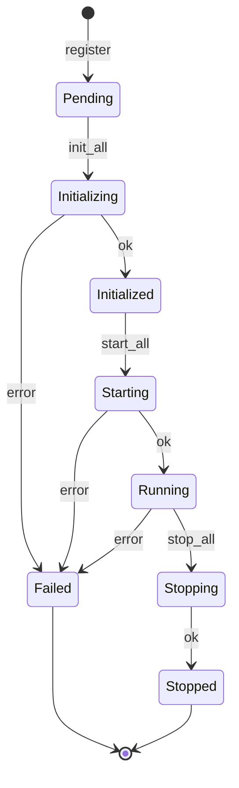

# `ComponentRegistry`

> Dependency-aware orchestrator for the `Component` lifecycle.

`ComponentRegistry` is the **lifecycle orchestrator**. It owns a typed collection of `Component` instances, drives them through `init → start → [serve] → stop` in dependency order, exposes a typed lookup, and aggregates health. The trait provides the primitive contract; the registry handles the **graph**.

The full file is `src/runtime/registry.rs`.

## Why a separate registry

A `Component` is a single instance. In practice, the runtime has many of them, and they depend on each other: the OpenAI adapter depends on the HTTP client; the context pipeline depends on the session store; the snapshot store depends on the S3 client. Bootstrapping them in the right order, recovering from partial failures, and downcasting `Box<dyn AnyComponent>` back to `Arc<MyType>` for callers who know what they want — all of this lives in the registry.

## State machine

Each registered component moves through this state machine independently:



`health()` aggregates all states: `healthy` if every component is `Running`, `degraded` if any is `Failed` but others are `Running`, `unhealthy` if no component is `Running`.

## API

```rust
use behest::runtime::registry::ComponentRegistry;
use behest::runtime::lifecycle::ShutdownToken;

let registry = ComponentRegistry::with_shutdown(ShutdownToken::new());

// Register a factory by name; the registry stores the factory, not the instance.
registry.register_factory("primary.openai", OpenAiChatComponent::NAME, factory)?;

// Drive the lifecycle.
registry.init_all().await?;
registry.start_all().await?;

// Typed lookup.
let openai: Arc<OpenAiChatComponent> = registry.get("primary.openai")?;

// Health.
let aggregate = registry.health().await;  // healthy | degraded | unhealthy

// Graceful shutdown.
registry.stop_all().await?;
```

### Errors

```rust
pub enum RegistryError {
    AlreadyRegistered { name: String },
    NotFound { name: String },
    NotInitialized { name: String },
    NotRunning { name: String },
    InitFailed { name: String, source: Box<dyn Error + Send + Sync> },
    StartFailed { name: String, source: Box<dyn Error + Send + Sync> },
    DependencyCycle { cycle: Vec<String> },
    DowncastFailed { name: String, type_name: &'static str },
}
```

The variants are `#[non_exhaustive]`.

## Dependency order

Components declare their dependencies via `Component::depends_on()`. The registry topologically sorts the registered names before driving `init_all` / `start_all`. Cycles return `RegistryError::DependencyCycle { cycle }` with the offending node sequence.

```rust
impl Component for ContextPipelineComponent {
    fn depends_on() -> &'static [&'static str] {
        &["store.session.memory", "store.embedding.memory"]
    }
    // ...
}
```

## Typed downcast

`registry.get::<MyComponent>("name")` returns `Result<Arc<MyComponent>, RegistryError>`. The downcast uses the `as_any_arc` method on `AnyComponent`. The registry stores a side-table of concrete type names for diagnostics.

```rust
let store: Arc<MemorySessionStoreComponent> = registry.get("store.session.memory")?;
let inner: &MemorySessionStore = &store.inner;
```

`TypedAnyComponent` and `TypedFactory` are convenience wrappers that make the downcast ergonomic.

## Hot-swap: `replace_instance`

`replace_instance` performs a drain-aware atomic swap of a running component:

```rust
let old = registry.replace_instance("db", new_instance).await?;
// old is Arc<dyn AnyComponent> — existing Arc clones keep it alive
```

The protocol:

1. **Validate** — the component must be in `Running` state.
2. **Pre-replace hook** — `pre_replace` is called on the old instance (signal it will stop accepting new traffic).
3. **Start new** — `start` is called on the new instance. If it fails, the old instance remains in place.
4. **Atomic swap** — the registry slot is updated. New lookups return the new instance.
5. **Post-replace hook** — `post_replace` is called on the old instance (best-effort; errors are logged but do not roll back).

Returns the old `Arc<dyn AnyComponent>`. Existing `Arc` clones held by other tasks keep the old instance alive until dropped (natural drain via reference counting).

### Errors

| Condition | Variant |
|-----------|---------|
| Name not registered | `RegistryError::NotFound` |
| Component not in `Running` state | `RegistryError::Reload` |
| `pre_replace` or `start` fails | `RegistryError::Reload` |

## Worked example

```rust
use std::sync::Arc;
use behest::runtime::registry::ComponentRegistry;
use behest::runtime::factory_registry::FactoryRegistry;
use behest::runtime::lifecycle::ShutdownToken;
use behest::runtime::components::{
    default_factory_registry, OpenAiChatComponent,
    MemorySessionStoreComponent,
};

#[tokio::main]
async fn main() -> Result<(), Box<dyn std::error::Error>> {
    let registry = ComponentRegistry::with_shutdown(ShutdownToken::new());
    let factories: FactoryRegistry = default_factory_registry();

    // Register the same factory under two names.
    let ctx = registry.context();
    registry.register_factory(
        "openai.primary",
        OpenAiChatComponent::NAME,
        factories.get("provider.openai.chat")?,
    )?;
    registry.register_factory(
        "store.session.default",
        MemorySessionStoreComponent::NAME,
        factories.get("store.session.memory")?,
    )?;

    registry.init_all().await?;
    registry.start_all().await?;
    assert!(registry.health().await.is_healthy());
    Ok(())
}
```

## Edge cases

- **Partial init failure** — if component B's `init` fails, the registry stops. Components that succeeded are kept in the `Initialized` state; you can re-call `init_all` after fixing the underlying issue. The failed component is reported via `health()`.
- **Idempotent start** — calling `start_all` twice in a row is a no-op. Calling `start_all` after a `stop_all` is also a no-op (state machine already past the transition).
- **Stop on uninitialized component** — `stop_all` is a no-op for components that never reached `Running`. No error.
- **Cycle in `depends_on`** — returned as `RegistryError::DependencyCycle`. The cycle is the topological sort result, in the order that closes back to the start.
- **Missing dependency** — if `Component::depends_on` returns `["nonexistent"]`, `init_all` returns `RegistryError::NotFound { name: "nonexistent" }`. Dependencies must be registered.

## Relationship to other components

- **[Component](component-trait.md)** — the trait that components implement.
- **[FactoryRegistry](factory-registry.md)** — the kind → factory mapping used to populate the registry.
- **[Extensions](extensions-facade.md)** — the runtime-facing facade that reads from the same underlying instances.
- **[ExtensionPoint](extension-point.md)** — the storage primitive; the registry may use it for the registry of registered components.

## See also

- **[Component](component-trait.md)** — the lifecycle contract.
- **[FactoryRegistry](factory-registry.md)** — populating the registry.
- **[Extensions](extensions-facade.md)** — the runtime-facing view.
