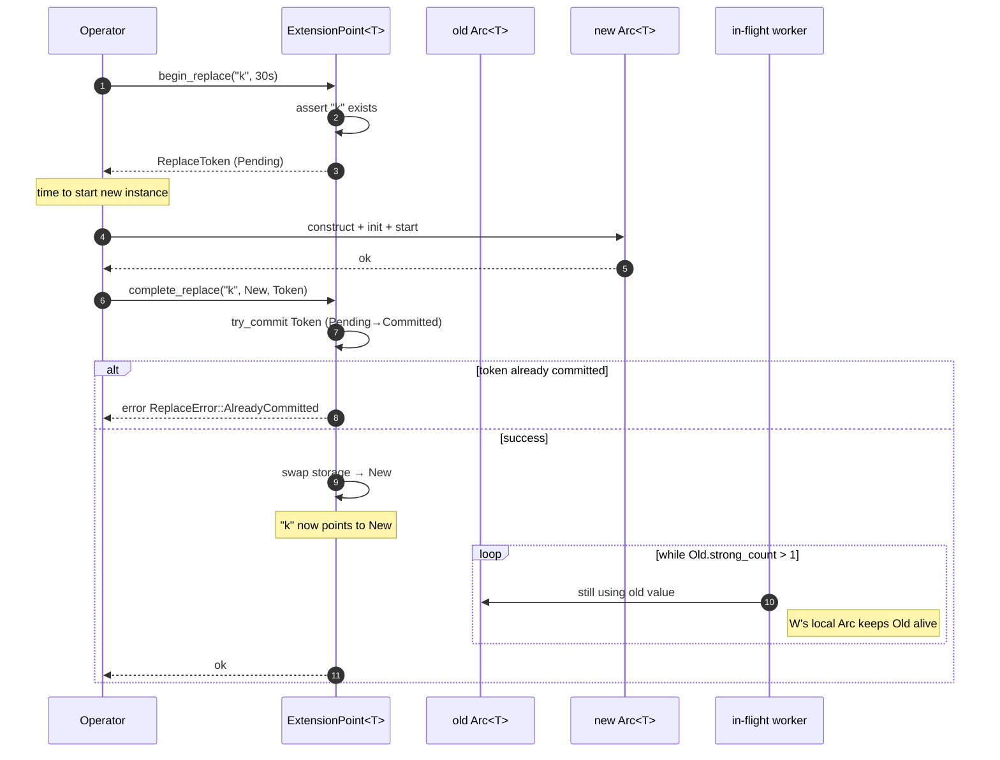
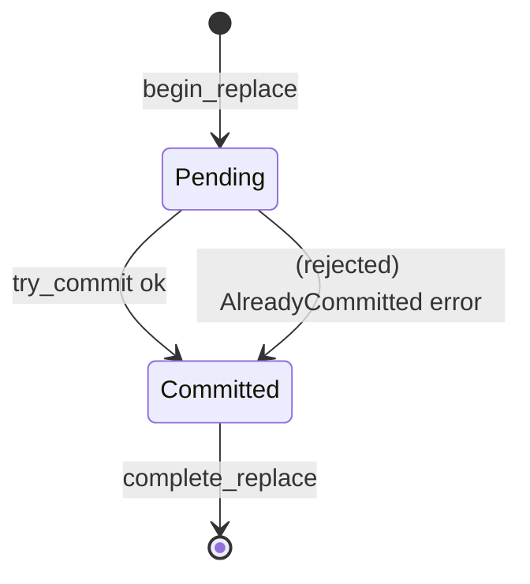

# Drain-aware Replace

> A two-phase atomic swap protocol for hot-pluggable runtime elements.

When you replace a registered `Arc<T>` inside an `ExtensionPoint<T>`, a naïve `HashMap::insert` drops the old value. If a request is mid-flight on the old instance, that request gets **abruptly cancelled** — which usually manifests as a broken connection, a tool call returning `ProviderError::Transport`, or worse, a corrupt state.

The drain-aware replace protocol gives the old instance time to **finish what it was doing** before the storage slot is overwritten. The default deadline is 30 seconds. After the deadline, the swap proceeds even if in-flight requests are still active; the old value is then "leaked" until its last external holder drops it.

The full files are `src/runtime/extension.rs` (the protocol) and `src/runtime/replace.rs` (the token).

## Why this exists

`ProviderRegistry::register_chat_arc` in the legacy layout **silently replaced** the old provider. In production this had two failure modes:

1. **Aborted in-flight requests.** A `runtime.run()` call that had already issued a model request would, after the swap, attempt to consume a stream from the **new** provider using a request id issued to the **old** provider. The new provider returned `404 Not Found`; the call failed.
2. **Half-applied tool calls.** A tool execution that had been dispatched to the old store and was in the middle of writing to it would suddenly find the store disconnected, returning a partial result that was persisted by the new store under the same key.

The drain protocol eliminates both failure modes for the common case (in-flight requests that finish within 30 seconds).

## Phases

The protocol is a strict two-phase commit.



### Phase 1 — `begin_replace`

```rust
let token = exts.chat_providers.begin_replace("openai", Duration::from_secs(30))?;
```

What this does:

- Asserts that the name exists in the extension point. If not, returns `ExtensionError::NotFound`.
- Allocates a fresh `ReplaceToken` in the `Pending` state. The token is `Clone` so it can be moved into a deadline task.
- Does **not** touch the storage map. Until `complete_replace` runs, `get("openai")` still returns the old `Arc<T>`.

This phase is intentionally cheap. Operators use this window to construct and start the new instance in parallel with the old one still serving traffic.

### Phase 2 — `complete_replace`

```rust
let ep_arc: Arc<ExtensionPoint<dyn ChatProvider>> = Arc::clone(&exts.chat_providers);
ep_arc.complete_replace("openai", Arc::new(new_openai), token).await?;
```

What this does:

- Atomically commits the token (`Pending → Committed`). If the token was already committed, returns `ReplaceError::AlreadyCommitted`.
- Atomically swaps the storage slot to point at the **new** value. **New requests now see the new value.**
- Polls `Arc::strong_count` of the **old** value in a 10 ms loop:
  - If `strong_count == 1`, the only reference is the storage slot — but we just removed it by swapping, so this means the old value is fully released.
  - If `strong_count > 1`, external holders are still using it. We wait.
- If the `drain_timeout` (30 s default) elapses while `strong_count > 1`, the swap still completes; the old value simply remains in memory until its last external holder drops it.



## `ReplaceToken`

The token is a one-shot, cloneable handle.

```rust
#[derive(Debug, Clone)]
pub struct ReplaceToken {
    state: Arc<AtomicBool>,
    timeout: Duration,
}

impl ReplaceToken {
    pub fn new(timeout: Duration) -> Self;
    pub fn state(&self) -> ReplaceState;        // Pending | Committed
    pub fn timeout(&self) -> Duration;
    pub(crate) fn try_commit(&self) -> Result<(), ReplaceError>;
}
```

`ReplaceToken` is **deliberately not coupled** to a specific `ExtensionPoint`. It can be moved freely between tasks. The typical pattern is:

```rust
let token = exts.chat_providers.begin_replace("openai", Duration::from_secs(15))?;
let deadline_token = token.clone();
let deadline = tokio::spawn(async move {
    tokio::time::sleep(Duration::from_secs(15)).await;
    // If we reach here and the swap hasn't committed, surface a warning.
    if deadline_token.state() == ReplaceState::Pending {
        tracing::warn!("hot swap deadline reached, swap not yet committed");
    }
});

exts.chat_providers
    .complete_replace("openai", Arc::new(new_openai), token)
    .await?;
```

## API

```rust
impl<T: ?Sized> ExtensionPoint<T> {
    pub fn begin_replace(
        &self,
        name: &str,
        drain_timeout: Duration,
    ) -> Result<ReplaceToken, ExtensionError>;

    pub async fn complete_replace(
        self: Arc<Self>,
        name: &str,
        new_value: Arc<T>,
        token: ReplaceToken,
    ) -> Result<(), ExtensionError>;
}
```

`complete_replace` takes `self: Arc<Self>` because the implementation may need to keep the extension point alive across `await` points. Most callers already have an `Arc<ExtensionPoint<T>>` because they are inside a `Component` or a `ComponentRegistry` that holds one.

## Worked example — provider hot-swap

```rust
use std::sync::Arc;
use std::time::Duration;
use behest::runtime::extensions::Extensions;
use behest::runtime::replace::DEFAULT_DRAIN_TIMEOUT;

async fn swap_openai_provider(
    exts: Arc<Extensions>,
    new_adapter: Arc<dyn behest::provider::ChatProvider>,
) -> Result<(), Box<dyn std::error::Error>> {
    // Phase 1: announce the swap. Old `openai` is still serving.
    let token = exts.chat_providers
        .begin_replace("openai", DEFAULT_DRAIN_TIMEOUT)?;

    // Construct and start the new adapter in parallel.
    // (e.g. via OpenAI's /v1/models handshake.)
    // new_adapter.warmup().await?;

    // Phase 2: commit. New requests now go to new_adapter; old is drained.
    exts.chat_providers
        .complete_replace("openai", new_adapter, token)
        .await?;
    Ok(())
}
```

## Edge cases & error semantics

- **Name not present** — `begin_replace` returns `ExtensionError::NotFound` if the name was never registered. You cannot "replace something that does not exist"; use `register` first.
- **Token already committed** — a second `complete_replace` call with the same token returns `ReplaceError::AlreadyCommitted`. This guards against a `select!` race where two tasks both try to complete the swap.
- **Name disappears between phases** — if `unregister("k")` is called between `begin_replace` and `complete_replace`, the second phase returns `ExtensionError::NotFound`. This is intentional: a concurrent unregister means the operator changed their mind, and the swap should abort.
- **Drain timeout exceeded** — the swap still completes; the old value remains in memory until its last external holder drops it. There is **no error returned** for this; it is a normal condition under load. The caller can check the wall-clock duration between `begin_replace` and `complete_replace` to detect it.
- **Strong count 0 at swap time** — if, for some reason, the storage slot was the only reference (e.g. the runtime had no in-flight requests and nothing held an `Arc<T>` externally), the swap completes instantly.
- **Drain phase under contention** — the drain loop polls every 10 ms; for thousands of in-flight requests the polling overhead is negligible. The drain does **not** notify; if you need push-style completion, hold your own counter.

## Relationship to other components

The protocol is implemented entirely in `ExtensionPoint`; `Extensions` just exposes it. The consumer is `ManagedRuntime::reload`, which uses the protocol to swap providers, stores, and any other hot-pluggable component without dropping in-flight traffic.

- **[ExtensionPoint](extension-point.md)** — implements the protocol.
- **[Extensions](extensions-facade.md)** — exposes the protocol via its 13 `ExtensionPoint` fields.
- **[ManagedRuntime](../ops/managed-runtime.md)** — the high-level `reload(name, new_cfg)` API.
- **[Hot Reload](../ops/hot-reload.md)** — the full operational story: pre-replace hooks, post-replace hooks, drain timeouts.

## See also

- **[ExtensionPoint](extension-point.md)** — the storage primitive.
- **[ManagedRuntime](../ops/managed-runtime.md)** — the planned top-level orchestrator.
- **[Hot Reload](../ops/hot-reload.md)** — operator-facing hot-reload guide.
