# `Extensions`

> The composable, hot-pluggable facade over every pluggable runtime element.

`Extensions` is the central struct that the rest of the runtime reads from. Every category of plug-in — chat providers, embedding providers, tools, context adapters, session stores, execution stores, embedding stores, artifact stores, run stores, event publishers, session data stores, runtime event stores, snapshot stores — is exposed here as an `ExtensionPoint<T>`. Operators compose a runtime by registering implementations by name, and can hot-swap any registered instance at runtime.

The full file is `src/runtime/extensions.rs`.

## Why a facade

In the legacy layout, the `AgentRuntime` constructor accepted **eleven** distinct arguments — provider registry, session store, execution store, embedding store, artifact store, run store, tool registry, context pipeline, snapshot store, runtime event store, runtime stream adapter. Each one had to be constructed by the caller in the right order, with the right bounds, and **every public method on the runtime had to look up the right one**. The cost was real:

- The `AgentRuntime` API surface was eleven constructor arguments long, and the `into_runtime` builder was correspondingly wide.
- Hot-swap was an after-thought. Replacing a provider required a full `AgentRuntime` rebuild.
- Tests had to wire up all eleven collaborators even when they cared about only one.
- Cross-cutting fields (snapshot store, event store) had to be threaded through every layer.

The `Extensions` facade is the **single source of truth**: a struct of 13 `ExtensionPoint` fields, cloned cheaply, read concurrently. `AgentRuntime::new` takes one `Arc<Extensions>` and one `RuntimePolicy`. Tests that only care about a single dimension register a single field and pass the rest empty.

## Definition

```rust
use crate::provider::{ChatProvider, EmbeddingProvider};
use crate::runtime::extension::ExtensionPoint;
use crate::store::{ArtifactStore, EmbeddingStore, ExecutionStore, SessionStore};
use crate::tool::Tool;
use crate::context::ContextAdapter;
use crate::runtime::store::RunStore;
use crate::runtime::event_store::RuntimeEventStore;
use crate::runtime::invocation::SessionDataStore;
use crate::runtime::snapshot::SnapshotStore;
use crate::queue::EventPublisher;   // feature = "queue"

#[derive(Clone, Default)]
pub struct Extensions {
    pub chat_providers:         ExtensionPoint<dyn ChatProvider>,
    pub embedding_providers:    ExtensionPoint<dyn EmbeddingProvider>,
    pub tools:                  ExtensionPoint<dyn Tool>,
    pub context_adapters:       ExtensionPoint<dyn ContextAdapter>,
    pub session_stores:         ExtensionPoint<dyn SessionStore>,
    pub execution_stores:       ExtensionPoint<dyn ExecutionStore>,
    pub embedding_stores:       ExtensionPoint<dyn EmbeddingStore>,
    pub artifact_stores:        ExtensionPoint<dyn ArtifactStore>,
    pub run_stores:             ExtensionPoint<dyn RunStore>,
    #[cfg(feature = "queue")]
    pub event_publishers:       ExtensionPoint<dyn EventPublisher>,
    pub session_data_stores:    ExtensionPoint<dyn SessionDataStore>,
    pub runtime_event_stores:   ExtensionPoint<dyn RuntimeEventStore>,
    pub snapshot_stores:        ExtensionPoint<dyn SnapshotStore>,
}
```

## Construction

Three idiomatic paths, in increasing order of control:

### 1. `Extensions::default()` — greenfield

```rust
use behest::runtime::extensions::Extensions;

let exts = Extensions::default();
exts.chat_providers.register("openai", Arc::new(my_openai_adapter))?;
exts.session_stores.register("memory", Arc::new(MemorySessionStore::new()))?;
```

`Default` produces an empty facade. You register exactly the fields you care about and leave the rest empty. The runtime tolerates empty fields: an empty `chat_providers` means the runtime cannot complete a chat turn, but it still constructs and emits events for state transitions.

### 2. From `AgentConfig`

```rust
let exts = config.into_extensions().await?;  // Async; may open connections.
let runtime = AgentRuntime::new(Arc::new(exts), policy);
```

`AgentConfig::into_extensions` walks the loaded config, constructs the appropriate `Component` for each entry (via `FactoryRegistry`), runs `init` and `start`, and registers the resulting instances under their config-defined names. This is the path that 95% of users take.

### 3. Programmatic, fine-grained

```rust
let mut exts = Extensions::default();
exts.chat_providers.register_or_replace("primary",   Arc::new(openai))?;
exts.chat_providers.register_or_replace("fallback",  Arc::new(anthropic))?;
exts.session_stores.register_or_replace("default",  Arc::new(pg_store))?;
exts.snapshot_stores.register_or_replace("default",  Arc::new(s3_snapshots))?;
// Build a router on top of the facade.
let router = ModelRouter::new(Arc::new(ProviderRegistry::from_extensions(&exts)), router_policy);
let runtime = AgentRuntime::new(Arc::new(exts), policy);
```

## Threading and ownership

```mermaid
flowchart LR
  subgraph "Crate-internal code"
    A["AgentRuntime"]
    B["ModelRouter"]
    C["ContextPipeline"]
    D["ToolRuntime"]
    E["RuntimeStore"]
  end
  subgraph "Extensions"
    EP1["chat_providers"]
    EP2["embedding_providers"]
    EP3["session_stores"]
    EP4["runtime_event_stores"]
  end
  A -->|reads| EP1
  A -->|reads| EP3
  B -->|reads| EP1
  C -->|reads| EP2
  D -->|reads| EP1
  E -->|reads| EP3
  E -->|reads| EP4
  style Extensions fill:#1A1A1A,stroke:#7C3AED
```

Every field is an `ExtensionPoint<T>`, which is internally `Arc`-backed. Cloning `Extensions` is cheap (a single stack-to-stack copy of thirteen `Arc` pointers). All clones observe the same set of registered entries.



The runtime holds an `Arc<Extensions>` internally and exposes it via `AgentRuntime::extensions()`. Operators and observability code can therefore inspect the current plug-in set without going through runtime methods:

```rust
let exts = runtime.extensions();
for name in exts.chat_providers.names() {
    tracing::info!(provider = %name, "registered");
}
```

## Populated categories

`Extensions::populated_categories()` returns a count of how many fields have at least one entry. Useful for assertions in tests:

```rust
let exts = Extensions::default();
exts.chat_providers.register("openai", Arc::new(openai))?;
exts.session_stores.register("memory", Arc::new(MemorySessionStore::new()))?;
assert_eq!(exts.populated_categories(), 2);
```

## Hot-swap via the facade

Because every field is an `ExtensionPoint`, hot-swap is uniformly available. The exact protocol depends on what you are swapping — the runtime itself doesn't observe the swap; the underlying `ExtensionPoint` handles the live-reference and drain logic.

```rust
// Plain replace: swap, but the old instance is dropped when the last holder releases it.
let old = exts.chat_providers.replace("openai", Arc::new(new_openai))?;

// Drain-aware replace: wait for in-flight requests on `openai` to finish.
let token = exts.chat_providers.begin_replace("openai", DEFAULT_DRAIN_TIMEOUT)?;
let ep_arc = Arc::clone(&exts.chat_providers);  // need Arc<Self> for complete_replace
ep_arc.complete_replace("openai", Arc::new(new_openai), token).await?;
```

For `ManagedRuntime::reload`, the contract is the latter. See **[Drain-aware Replace](drain-aware-replace.md)** for the timing diagram and timeout semantics.

## Worked example — minimal composable runtime

```rust
use std::sync::Arc;
use behest::runtime::extensions::Extensions;
use behest::runtime::agent::AgentRuntime;
use behest::runtime::policy::RuntimePolicy;
use behest::provider::ProviderId;

#[tokio::main]
async fn main() -> Result<(), Box<dyn std::error::Error>> {
    let mut exts = Extensions::default();

    // Register a single chat provider under the name "primary".
    let openai = build_openai_chat_adapter().await?;
    exts.chat_providers.register("primary", Arc::new(openai))?;

    // Register an in-memory session store.
    exts.session_stores
        .register("memory", Arc::new(MemorySessionStore::new()))?;

    let runtime = AgentRuntime::new(Arc::new(exts), RuntimePolicy::default());
    let out = runtime.run_one_shot("primary", "Hello, world.").await?;
    println!("{}", out);
    Ok(())
}
```

No global registry; no `AgentConfig`; no builder. The runtime is **just** a struct plus a policy, with the facade as the only collaborator.

## Edge cases & error semantics

- **Empty facade** — `Extensions::default()` produces a fully empty facade. Constructing an `AgentRuntime` over it succeeds; calling `runtime.run` returns a `ProviderError::Unsupported` from `ModelRouter` because no chat provider is registered. This is the desired failure mode: the user knows immediately what is missing.
- **Duplicate names within a field** — the second `register` returns `ExtensionError::AlreadyRegistered`. Use `register_or_replace` to silently overwrite.
- **Cross-field duplicates** — there is no namespace cross-check between `chat_providers` and `embedding_stores`. The name `"primary"` in `chat_providers` and the name `"primary"` in `embedding_stores` are independent.
- **Drop semantics** — when the last `Arc<Extensions>` is dropped, the inner `ExtensionPoint`s are dropped. They hold `Arc<T>` for each registered value. Those values live until their last external holder releases them. In other words, **dropping `Extensions` does not eagerly drop registered implementations**.
- **Cloning** — `Clone` is `#[derive(Clone)]` and produces a struct with the same `Arc`-backed fields. A clone and the original are indistinguishable observers of the same underlying data.
- **Feature gating** — `event_publishers` is `#[cfg(feature = "queue")]`. The struct is `Default`-implemented in two variants: with the field (feature on) and without it (feature off). The `Default` impl is auto-derived and handles both cases.

## Relationship to other components

`Extensions` is the data structure; everything else reads from it.

- **[`ExtensionPoint<T>`](extension-point.md)** — the underlying storage primitive.
- **[`AgentRuntime`](../runtime/agent-runtime.md)** — owns an `Arc<Extensions>` and delegates every collaborator lookup to it.
- **[`FactoryRegistry`](factory-registry.md)** — the kind → factory mapping used to populate `Extensions` from config.
- **[`ComponentRegistry`](component-registry.md)** — pairs with `Extensions`; the registry holds the lifecycle, the facade holds the storage.

## See also

- **[ExtensionPoint](extension-point.md)** — the storage primitive.
- **[Drain-aware Replace](drain-aware-replace.md)** — the two-phase swap protocol.
- **[AgentRuntime](../runtime/agent-runtime.md)** — the consumer of the facade.
- **[FactoryRegistry](factory-registry.md)** — populating the facade from config.
- **[ManagedRuntime](../ops/managed-runtime.md)** — the planned top-level orchestrator.
