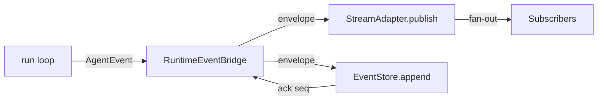

# `RuntimeEventBridge`

> Bridges the run loop to the event pipeline.

`RuntimeEventBridge` is the in-process component that turns the `AgentEvent` values emitted by the run loop into `RuntimeEventEnvelope`s, then publishes them to the `RuntimeStreamAdapter` and appends them to the `RuntimeEventStore`. It is the runtime's single point of contact with the event pipeline.

The full file is `src/runtime/subscription.rs` (the `RuntimeEventBridge` struct).

## API

```rust
impl RuntimeEventBridge {
    pub fn new(
        store: Arc<dyn RuntimeEventStore>,
        adapter: Arc<dyn RuntimeStreamAdapter>,
        session_map: SessionMap,
    ) -> Self;

    pub fn handle(&self) -> RuntimeEventBridgeHandle;
    pub async fn emit(&self, request: EmitRequest) -> Result<(), RuntimeEventBridgeError>;
}

pub struct EmitRequest {
    pub kind: EventKind,
    pub room: RuntimeRoom,
    pub dedup_key: Option<String>,
    pub max_buffer: usize,
}
```

## Flow



`emit` is fire-and-forget; it returns once the event is published to the adapter and appended to the store. Failures are logged and counted, not returned to the run loop.

## See also

- **[AgentEvent](agent-event.md)** — the input.
- **[RuntimeEventStore](runtime-event-store.md)** — the durable sink.
- **[RuntimeStreamAdapter](runtime-stream-adapter.md)** — the live fanout.
