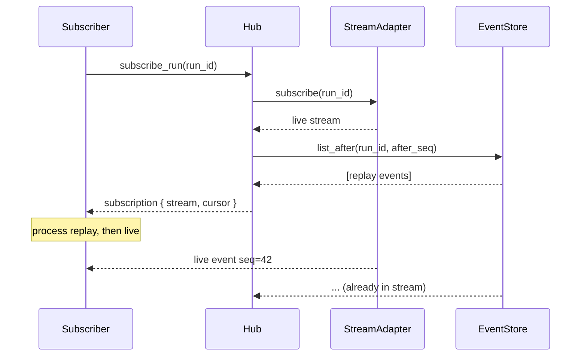

# `RuntimeSubscriptionHub`

> Live-then-replay subscription semantics.

`RuntimeSubscriptionHub` is the recommended way to subscribe to events. It opens a **live** subscription first (so no events are lost), then **replays** from the `RuntimeEventStore` from the last `seq` the subscriber has seen. Subscribers deduplicate overlapping events by `seq`.

The full file is `src/runtime/subscription.rs`.

## API

```rust
impl RuntimeSubscriptionHub {
    pub fn new(store: Arc<dyn RuntimeEventStore>, adapter: Arc<dyn RuntimeStreamAdapter>) -> Self;
    pub fn subscribe_run(&self, run_id: RunId) -> RuntimeSubscription;
    pub fn subscribe_session(&self, session_id: Uuid) -> RuntimeSubscription;
    pub fn subscribe_provider(&self, provider: ProviderId) -> RuntimeSubscription;
}

pub struct RuntimeSubscription {
    pub stream: BoxRuntimeEventStream,
    pub cursor: u64,
}
```

## Live-then-replay order



The subscriber sees: replay (oldest first), then live (newest). Duplicates by `seq` are de-duplicated by the subscriber.

## See also

- **[RuntimeEventStore](runtime-event-store.md)** — the durable path.
- **[RuntimeStreamAdapter](runtime-stream-adapter.md)** — the live path.
- **[RuntimeInvocation](runtime-invocation.md)** — the higher-level facade.
