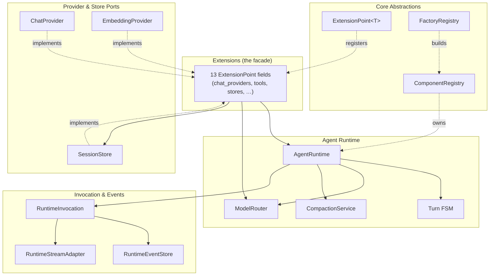

# Overview

> **behest** /bɪˈhest/ — *n.* a person's orders or command.
> At the **behest** of the user, the agent acts.

`behest` is a Rust-native agent runtime library. It provides provider-neutral contracts for chat, streaming, tool calling, embeddings, persistence, queues, RAG, observability — assembled from small, hot-pluggable components that you can compose, replace, and reload at runtime.

The crate is built for systems that need **explicit control** over model providers, tool execution, persistence, and operational boundaries — instead of opaque "agent framework" magic.

## Why behest

The core of an agent runtime is not "autonomous consciousness" but **controlled delegation**: the user issues an intent, and the system composes context, invokes models, executes tools, persists state, and publishes events within explicit boundaries — auditable, recoverable, constrainable, and replaceable.

The name deliberately avoids inflated metaphors. It only states an engineering fact:

> tool-calling, streaming, memory, queue, RAG, snapshot — all mechanisms exist because someone gave an order.

## Design goals

- **Rust-native first** — typed APIs, explicit errors, no hidden runtime assumptions.
- **Provider-neutral core** — OpenAI, Anthropic, local models, proxies, or internal providers can all implement the same contracts.
- **Streaming-first runtime** — the agent loop is designed around streamed model events, with non-streaming fallback where appropriate.
- **Typed tool boundary** — tools are described by JSON Schema and executed through explicit registries.
- **Pluggable persistence** — memory by default, external stores behind feature flags.
- **Operational surface** — event publishing, snapshots, session gates, compaction, retry policy.
- **Small public API** — foundation primitives over framework sprawl.

## The component graph

behest is built from a small set of layered components. The boxes below are the **core abstractions**; everything else is a specialised application of them.

Every box is a documented component page. Start anywhere; the **Related components** section at the bottom of each page walks the graph.

## What you can build

| Area | Capability |
|---|---|
| Provider contracts | `ChatProvider`, `EmbeddingProvider`, request/response models, stream events, provider capabilities |
| Provider registry | In-memory routing for chat and embedding providers |
| Chat model types | messages, content parts, tool calls, response formats, token usage, finish reasons |
| Tool runtime | `Tool`, `FunctionTool`, `ExternalTool`, `ToolRegistry`, schema generation, execution dispatch |
| Agent runtime | context building, model calls, tool loop, session persistence, event emission |
| Runtime safety | session gate, runtime policy, input admission, doom-loop detection, tool output truncation |
| Storage | memory stores, Redis, SQLx, MongoDB, SurrealDB, object storage, Qdrant embeddings |
| Context and RAG | context adapters, static/function adapters, optional RAG adapter |
| Queues | optional event publishing through NATS or Redis Streams |
| Configuration | builder, file-based config, environment variable loading, secret indirection |
| Observability | tracing and optional OpenTelemetry integration |

## Where to go next

:::callout{type=tip}
If you are new to behest, read **[Quick Start](quick-start.md)** to install and run your first turn.
:::

The documentation is grouped into 10 sections. Pick your entry point:

- **[Core Abstractions](../core/extension-point.md)** — `ExtensionPoint`, `Extensions`, `Component`, `FactoryRegistry`. The composable substrate.
- **[Agent Runtime](../runtime/agent-runtime.md)** — the streaming-first FSM that drives every turn.
- **[Invocation & Events](../events/runtime-invocation.md)** — the transport-neutral emit/on facade.
- **[Context & Tools](../tools/tool-trait.md)** — the tool hierarchy, scopes, and the RAG adapter.
- **[Providers](../providers/chat-provider.md)** — provider ports, message types, and concrete adapters.
- **[Storage](../storage/storage-overview.md)** — store traits and feature-gated backends.
- **[Config & Cross-cutting](../config/agent-config.md)** — config, errors, observability, queue.
- **[Operations](../ops/managed-runtime.md)** — `ManagedRuntime` and the hot-reload protocol (planned).
- **[Reference](../ref/api-reference.md)** — full API index, development guide, migration notes.
