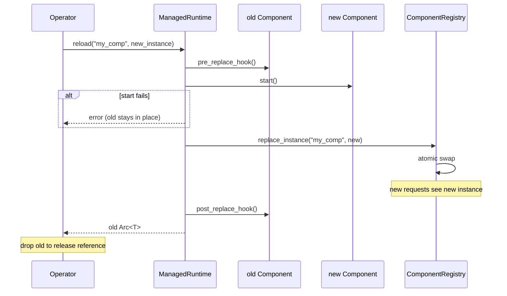

# Hot Reload

> Replace a running component without dropping in-flight traffic.

Hot reload is the operator-facing protocol built on the `ComponentRegistry::replace_instance` primitive and the `Component` lifecycle hooks. It allows replacing a chat provider, store, or any other `Component` while the runtime is serving requests.

The entry point is `ManagedRuntime::reload`:

```rust
let old = managed.reload::<MyComponent>("my_comp", new_instance).await?;
```

## Protocol



1. **Pre-replace hook** — the old instance signals that it will stop accepting new requests. In-flight requests continue.
2. **New instance starts** — the new component's `start()` is called. If it fails, the old instance remains in place and the error is returned.
3. **Swap** — `ComponentRegistry::replace_instance` atomically swaps the storage slot. New requests now see the new instance.
4. **Post-replace hook** — the old instance signals that it has been replaced. Best-effort; failure is logged but does not abort the swap.
5. **Return old Arc** — the caller receives the old `Arc<T>`. Existing `Arc<T>` clones held by other tasks keep the old instance alive until dropped (natural drain via `Arc` reference counting).

## Component hooks

The `Component` trait provides two optional hooks for hot-swap coordination:

```rust
#[async_trait]
pub trait Component: Send + Sync + 'static {
    // ... standard lifecycle methods ...

    /// Called before this component is replaced. Default is a no-op.
    /// Use this to reject new traffic, flush buffers, or signal upstream.
    async fn pre_replace_hook(&self) -> Result<(), Self::Error> {
        Ok(())
    }

    /// Called after this component has been replaced. Default is a no-op.
    /// Use this to clean up resources or notify upstream systems.
    async fn post_replace_hook(&self) -> Result<(), Self::Error> {
        Ok(())
    }
}
```

## Natural drain

Unlike the `ExtensionPoint` drain protocol (which polls `Arc::strong_count` in a loop), `ManagedRuntime::reload` uses **natural drain**: the old `Arc<T>` is returned to the caller, and any existing `Arc<T>` clones held by other tasks keep the old instance alive until they are dropped. There is no drain timeout — the old instance lives as long as its last reference.

## Worked example

```rust
use std::sync::Arc;
use behest::config::AgentConfigBuilder;

let managed = AgentConfigBuilder::default()
    .build_managed()
    .await?;

// Hold a reference to the current instance (e.g. an in-flight request).
let current: Arc<MyComponent> = managed.component::<MyComponent>("my_comp")?;

// Replace with a new instance.
let new = MyComponent { /* new config */ };
let old = managed.reload::<MyComponent>("my_comp", new).await?;

// Verify the registry now holds the new instance.
let updated: Arc<MyComponent> = managed.component::<MyComponent>("my_comp")?;

// Drop references — the old instance is naturally drained.
drop(current);
drop(old);
```

## Type-erased reload

For factory-driven or configuration-driven replacements, use `reload_raw`:

```rust
let new_instance: Box<dyn AnyComponent> = factory.invoke(kind, config, &ctx)?;
let old = managed.reload_raw("my_comp", new_instance).await?;
```

## Errors

| Condition | Error |
|-----------|-------|
| Name not registered | `ManagedError::ComponentNotFound` |
| New instance `start()` fails | `ManagedError::Reload` |
| Registry swap fails | `ManagedError::Registry` |
| Type mismatch | `ManagedError::Reload` |

## See also

- **[ManagedRuntime](managed-runtime.md)** — the consumer.
- **[Drain-aware Replace](../core/drain-aware-replace.md)** — the ExtensionPoint-level protocol.
- **[Component Trait](../core/component-trait.md)** — the lifecycle hooks.
