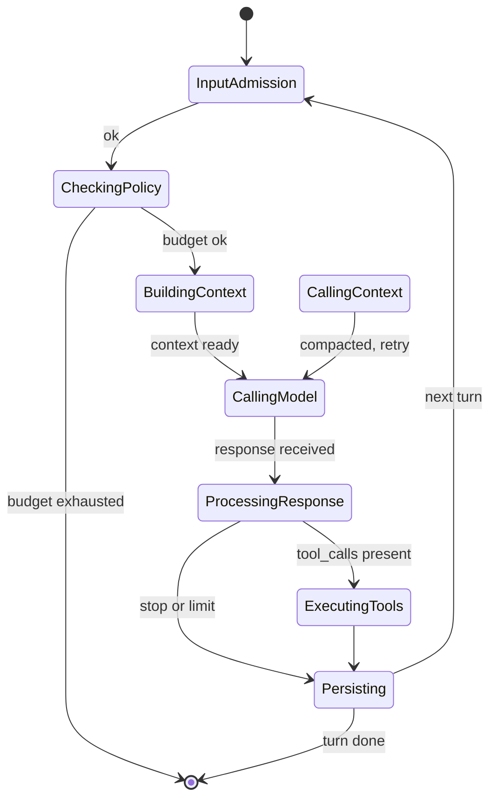

# `AgentRuntime`

> The orchestrator. One struct, one `Arc<Extensions>`, one `RuntimePolicy`.

`AgentRuntime` is the entry point for executing AI agent turns. It is the only struct in the runtime that owns the full execution loop: input admission, context building, model invocation, tool execution, persistence, event emission, and graceful shutdown. Everything else is a collaborator that the runtime pulls from `Arc<Extensions>` on demand.

The full file is `src/runtime/agent.rs`.

## Why a single orchestrator

Before the composable runtime refactor, the equivalent of `AgentRuntime` was a wide struct with **eleven** constructor arguments (one per collaborator). Every collaborator had to be wired up at the call site, in the right order, with the right bounds. The composable runtime replaces all of this with a single `Arc<Extensions>` facade:

- **Single source of truth.** Every collaborator lives behind an `ExtensionPoint<T>`. The runtime reads from the facade.
- **Hot-pluggable.** Any collaborator can be replaced at runtime via `ExtensionPoint::replace` or the drain-aware protocol. The runtime does not need to be rebuilt.
- **Cheap cloning.** Cloning `Arc<Extensions>` is cheap, so the runtime can hand out interior references freely (e.g. to the `BackgroundJobPool` and the `SnapshotStore`) without copying.
- **Test isolation.** Tests that care about a single dimension register a single field and pass the rest empty. No need to construct the full provider-stack in a test.

## Construction

```rust
use std::sync::Arc;
use behest::runtime::agent::AgentRuntime;
use behest::runtime::extensions::Extensions;
use behest::runtime::policy::RuntimePolicy;

let exts = Arc::new(Extensions::default());
let runtime = AgentRuntime::new(exts, RuntimePolicy::default());
```

`AgentRuntime::new` takes two arguments:

- `extensions: Arc<Extensions>` — the facade. The runtime reads collaborators from it.
- `policy: RuntimePolicy` — the operational policy. Limits, budgets, timeouts.

It does **not** take provider registries, store handles, or tool sets individually. To populate the facade, use `AgentConfig::into_extensions` (the high-level path) or call `register_or_replace` directly (the low-level path).

## Run loop

Every turn goes through a 6-state finite state machine.

```text
InputAdmission → CheckingPolicy → BuildingContext → CallingModel
                                                       │
                                                       ▼
                                              ProcessingResponse
                                                       │
                                       ┌───────────────┴────────────────┐
                                       ▼                                ▼
                              ExecutingTools                   [break loop]
                                       │
                                       ▼
                                  Persisting ──→ back to InputAdmission
```



The state machine is implemented in `src/runtime/turn.rs` (`TurnState`, `TurnTransition`). The orchestrator in `agent.rs` drives the loop, persisting events and snapshots between transitions.

## Public API

```rust
impl AgentRuntime {
    pub fn new(extensions: Arc<Extensions>, policy: RuntimePolicy) -> Result<Self, RuntimeError>;

    pub fn extensions(&self) -> &Arc<Extensions>;

    pub async fn run(&self, req: RunRequest) -> Result<RunOutput, RuntimeError>;
    pub async fn run_stream(&self, req: RunRequest) -> Result<RunStream, RuntimeError>;

    pub async fn resume(&self, snapshot: Snapshot) -> Result<RunOutput, RuntimeError>;
    pub async fn snapshot(&self, run_id: RunId) -> Result<Option<Snapshot>, RuntimeError>;

    pub async fn cancel(&self, run_id: RunId) -> Result<(), RuntimeError>;
    pub fn session_gate(&self) -> &SessionGate;

    pub async fn run_events(&self, run_id: RunId) -> Result<Vec<RuntimeEventEnvelope>, RuntimeError>;
    pub async fn run_state(&self, run_id: RunId) -> Result<RunState, RuntimeError>;
}
```

### `RunRequest` and `RunOutput`

```rust
pub struct RunRequest {
    pub session_id: Option<Uuid>,
    pub run_id: Option<RunId>,
    pub provider: ProviderId,
    pub model: ModelName,
    pub input: String,
    pub metadata: serde_json::Value,
    pub tool_choice: ToolChoice,
    pub client_request_id: Option<String>,
}

pub struct RunOutput {
    pub run_id: RunId,
    pub session_id: Uuid,
    pub final_message: String,
    pub total_usage: TokenUsage,
    pub tool_executions: Vec<ToolExecution>,
    pub finish_reason: FinishReason,
    pub events: Vec<RuntimeEventEnvelope>,
}
```

## Streaming

`run_stream` returns a `RunStream` that yields `AgentEvent` values as they are emitted. Internally the orchestrator wraps the model call in a `StreamAccumulator` that incrementally assembles text and tool-call arguments from the provider's stream.

```rust
use futures::StreamExt;

let mut stream = runtime.run_stream(req).await?;
while let Some(event) = stream.next().await {
    match event? {
        AgentEvent::TextDelta { delta, .. } => print!("{delta}"),
        AgentEvent::TurnCompleted { .. }     => break,
        _ => {}
    }
}
```

For long-running runs, callers can drop the `RunStream` and subscribe to events through the `RuntimeSubscriptionHub` instead.

## Crash recovery

Every state transition is preceded by a snapshot save. A run that crashed between two transitions can be resumed from the snapshot via `runtime.resume(snapshot)`. The resume replays the transitions to reconstruct the run state and continues from the last stable point.

Snapshots are stored in the `SnapshotStore` registered in `Extensions::snapshot_stores`. The default is the file-system-backed `FileSnapshotStore`; the in-memory `MemorySnapshotStore` is available for tests.

## Cancellation

`runtime.cancel(run_id)` is a non-blocking best-effort signal. The next time the run loop yields (between tool calls, or at the next model call), the cancellation is observed and the run terminates with `RunStatus::Cancelled`. In-flight model calls are not interrupted at the HTTP layer — the runtime waits for the current stream chunk to arrive and checks the cancellation flag before requesting the next.

## Configuration

The runtime's behaviour is governed by `RuntimePolicy`:

```rust
pub struct RuntimePolicy {
    pub max_iterations: usize,
    pub max_input_tokens: usize,
    pub max_total_tokens: usize,
    pub provider_timeout: Duration,
    pub tool_timeout: Duration,
    pub session_gate: SessionGateConfig,
    pub input_admission: InputAdmissionConfig,
    pub router: RouterPolicy,
    pub event_buffer: usize,
}
```

See **[Runtime Policy](runtime-policy.md)** for the full reference.

## Worked example

```rust
use std::sync::Arc;
use behest::runtime::agent::AgentRuntime;
use behest::runtime::extensions::Extensions;
use behest::runtime::policy::RuntimePolicy;
use behest::provider::{ProviderId, ModelName, RunRequest, ToolChoice};

#[tokio::main]
async fn main() -> Result<(), Box<dyn std::error::Error>> {
    let mut exts = Extensions::default();
    exts.chat_providers.register("openai", Arc::new(openai_adapter))?;
    exts.session_stores.register("memory", Arc::new(MemorySessionStore::new()))?;

    let runtime = AgentRuntime::new(Arc::new(exts), RuntimePolicy::default());

    let req = RunRequest {
        session_id: None,
        run_id: None,
        provider: ProviderId::new("openai"),
        model: ModelName::new("gpt-4o-mini"),
        input: "Hello!".into(),
        metadata: serde_json::Value::Null,
        tool_choice: ToolChoice::Auto,
        client_request_id: None,
    };

    let output = runtime.run(req).await?;
    println!("{}", output.final_message);
    Ok(())
}
```

## Edge cases

- **Empty chat_providers** — `runtime.run` returns `RuntimeError::Provider(Unsupported)` from the model router. There is no implicit fallback; the caller is expected to register at least one provider.
- **Cancelled mid-stream** — the run terminates with `RunStatus::Cancelled`. The in-flight provider request completes (its result is discarded), the run is persisted, and the events up to that point are returned.
- **Snapshot write failure** — the transition is **rolled back**. The state machine is fail-stop: a snapshot that fails to write is treated as a failed transition, and the run is left in the previous state. The error is reported via `RuntimeError::SnapshotFailed`.
- **Concurrent runs on the same session** — `SessionGate` ensures serialisation. The second run blocks until the first completes. The `session_gate_timeout` policy controls how long the second run will wait before giving up.
- **Provider timeout** — the `provider_timeout` policy enforces a wall-clock deadline on the model call. The current stream chunk is allowed to complete; the next request is not issued.
- **Doom loop** — if the same tool is called repeatedly with no progress, `DoomLoopDetector` raises `RuntimeError::DoomLoop { fingerprint, .. }`. The run is terminated; the operator can intervene.

## Relationship to other components

`AgentRuntime` is the **top-level consumer** of the `Extensions` facade. Every collaborator is read on demand:

- **[Extensions](../core/extensions-facade.md)** — the facade.
- **[Turn FSM](turn-fsm.md)** — the state machine.
- **[ModelRouter](model-router.md)** — provider routing, retry, fallback.
- **[ContextPipeline](context-pipeline.md)** — context building + compaction filter.
- **[CompactionService](compaction-service.md)** — proactive and reactive context compaction.
- **[InputAdmission](input-admission.md)** — input validate / dedup / admit.
- **[SessionGate](session-gate.md)** — per-session serialisation.
- **[SnapshotStore](snapshot-store.md)** — crash recovery.
- **[DoomLoopDetector](doom-loop-detector.md)** — duplicate / cycle detection.
- **[BackgroundJobPool](background-job-pool.md)** — async event persistence.
- **[RuntimePolicy](runtime-policy.md)** — operational limits.
- **[StreamAccumulator](stream-accumulator.md)** — incremental stream assembly.
- **[RunState](run-state.md)** — event-sourced state projection.

## See also

- **[Extensions Facade](../core/extensions-facade.md)** — the input.
- **[Turn FSM](turn-fsm.md)** — the loop.
- **[AgentEvent](../../events/agent-event)** — the output.
- **[ManagedRuntime](../../ops/managed-runtime.md)** — the planned top-level orchestrator.
