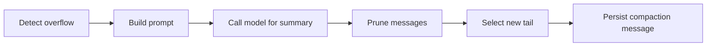

# `CompactionService`

> Trim the session history when it overflows the model's context window.

`CompactionService` is invoked by the **Turn FSM** in two situations:

- **Proactively**, when the `ContextPipeline` reports the requested context is over budget (after token trim).
- **Reactively**, when the model returns a `context_overflow` error (e.g. OpenAI's `context_length_exceeded`).

The service runs a 4-stage pipeline: **overflow → prompt → summary → prune → select**. Each stage is a separate function module; the orchestrator composes them.

The full file is `src/runtime/compaction/mod.rs`; the stages are in `overflow.rs`, `prompt.rs`, `prune.rs`, `select.rs`.

## Pipeline



### `overflow.rs`

Detects whether compaction is needed. Two signals:

- Token count exceeds the model's limit (`ContextOverBudget`).
- Message count exceeds the configured max (defaults to 50).

The decision is **idempotent**: the same input always produces the same answer, so the FSM can retry `CompactionService::compact` safely.

### `prompt.rs`

Builds the LLM prompt that asks the model to summarise the oldest messages. The prompt includes:

- A system instruction describing the summary format (a list of bullet points, structured for easy parsing).
- The messages to summarise, with their roles preserved.
- An instruction to keep factual details (numbers, names, decisions) and drop small talk.

### `prune.rs`

Applies the summary: marks the summarised messages as `is_compaction: true`, attaches the `CompactionMeta` with the `summary_text`, and updates the `MessageRecord`'s `tail_start_id` to point to the first message **after** the summarised range.

### `select.rs`

Decides which messages to keep in the immediate tail (the ones the model sees raw) and which become part of the summary. The default is to keep the last 4 turns (8 messages) raw and summarise everything older. This is configurable via `CompactionConfig::keep_recent_turns`.

## API

```rust
pub struct CompactionService {
    router: Arc<ModelRouter>,
    store: Arc<dyn SessionStore>,
    config: CompactionConfig,
}

impl CompactionService {
    pub fn new(
        router: Arc<ModelRouter>,
        store: Arc<dyn SessionStore>,
        config: CompactionConfig,
    ) -> Self;

    pub async fn compact(
        &self,
        session_id: Uuid,
        trigger: CompactionTrigger,
    ) -> Result<CompactionResult, RuntimeError>;
}

pub struct CompactionConfig {
    pub keep_recent_turns: usize,        // default 4
    pub max_summary_tokens: usize,       // default 1000
    pub summary_model: ModelName,         // default: same as runtime
    pub summary_provider: ProviderId,
    pub enable_incremental: bool,         // default true
}
```

### Errors

```rust
pub enum CompactionError {
    NoMessagesToCompact,
    SummaryFailed(ProviderError),
    PersistFailed(StorageError),
    CircuitOpen,   // after too many failures
}
```

## Idempotency

The pipeline is **idempotent**: calling `compact` twice on the same session with the same trigger produces the same final state. This is what allows the FSM to retry `CompactAndRetry` without producing duplicate compaction messages.

The idempotency key is `(session_id, last_summarised_message_id, current_head_count)`. If the key matches an existing compaction message, the call is a no-op.

## Incremental compaction

When `enable_incremental` is true and an existing compaction is found, the service does not re-summarise from scratch. Instead, it summarises only the **new** messages since the last compaction, then concatenates the existing summary with the new delta. This keeps the summary up to date without paying the full cost on every turn.

## Circuit breaker

If a compaction call fails (e.g. the model returns an error), the service increments a per-session counter. After `max_failures` (default 3), the session is marked `CompactionCircuitOpen` and subsequent calls return `CompactionError::CircuitOpen` until the operator intervenes. The circuit is also raised via an `AgentEvent::CompactionCircuitOpened` so external observers can act.

## Edge cases

- **Empty session** — returns `CompactionError::NoMessagesToCompact`. Not an error condition; just a no-op.
- **All messages already compacted** — the service returns the existing summary. No new LLM call.
- **Summary model has lower token limit than the messages being summarised** — the service chunks the input, summarises each chunk, then summarises the chunk-summaries. Recursive, bounded by `max_summary_tokens`.

## Relationship to other components

- **[ContextPipeline](context-pipeline.md)** — calls the service on overflow.
- **[Turn FSM](turn-fsm.md)** — calls the service from the `CompactAndRetry` action.
- **[ModelRouter](model-router.md)** — used to call the summary model.
- **[SessionStore](../../storage/session-store)** — persists the compaction message.

## See also

- **[ContextPipeline](context-pipeline.md)** — the caller.
- **[Turn FSM](turn-fsm.md)** — the orchestrator.
- **[ModelRouter](model-router.md)** — the underlying model call.
