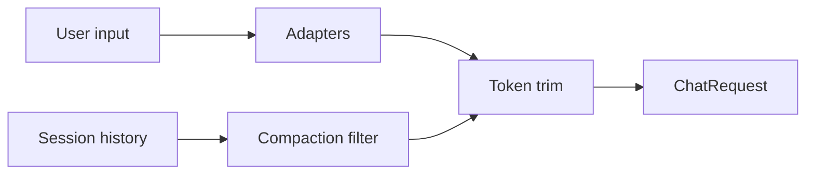

# `ContextPipeline`

> The run-time context builder.

`ContextPipeline` constructs a `ChatRequest` from the user input and the session state. It runs a sequence of `ContextAdapter`s, applies a compaction filter (so already-summarised messages are not re-sent), and trims the result to fit the token budget.

The full file is `src/runtime/context.rs`.

## Stages



1. **Adapters** — call each `ContextAdapter` registered in `Extensions::context_adapters` to inject extra context (system prompts, RAG snippets, function outputs).
2. **Compaction filter** — drop messages marked `is_compaction: true` whose `CompactionMeta::summary_text` is in scope; the model receives the summary instead of the raw messages.
3. **Token trim** — fit the message list into the model's context window by trimming the oldest non-system messages.

## API

```rust
pub struct ContextPipeline {
    adapters: Vec<Arc<dyn ContextAdapter>>,
    max_history_messages: usize,
    max_history_tokens: usize,
    enable_compaction_filter: bool,
}

impl ContextPipeline {
    pub fn new() -> Self;
    pub fn with_adapter(self, a: Arc<dyn ContextAdapter>) -> Self;
    pub fn with_max_history(self, n: usize) -> Self;
    pub fn with_max_history_tokens(self, n: usize) -> Self;
    pub fn with_compaction_filter(self, on: bool) -> Self;

    pub async fn build(
        &self,
        session: &Session,
        input: &str,
        store: &dyn SessionStore,
    ) -> Result<ChatRequest, ContextError>;
}
```

## Worked example

```rust
let pipeline = ContextPipeline::new()
    .with_adapter(Arc::new(StaticAdapter::new("You are concise.")))
    .with_adapter(Arc::new(RagContextAdapter::new(qdrant)))
    .with_max_history(50)
    .with_max_history_tokens(64_000)
    .with_compaction_filter(true);

let req = pipeline.build(&session, "Hello", &*store).await?;
```

## See also

- **[CompactionService](compaction-service.md)** — produces the compaction messages.
- **[ContextAdapter](../../tools/context-adapter)** — the adapter trait.
- **[RAG Context Adapter](../../tools/rag-context-adapter)** — the RAG implementation.
