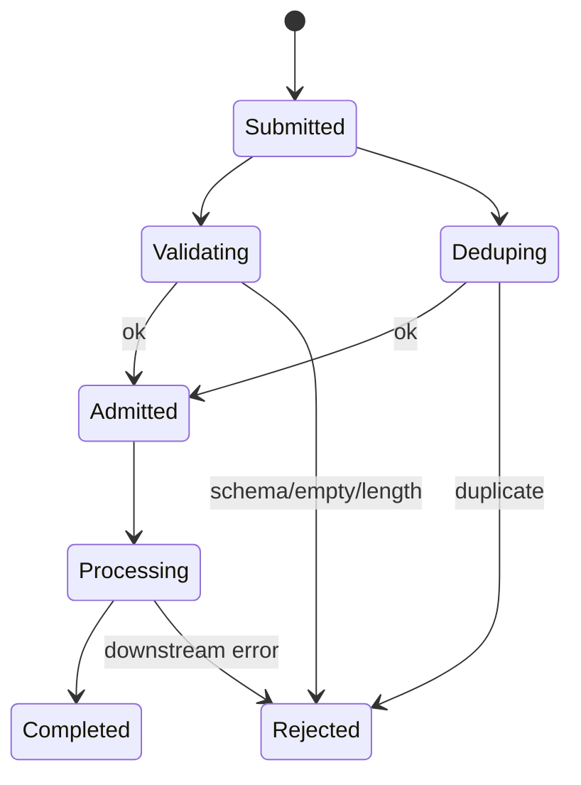

# `InputAdmission`

> The first gate of every turn.

`InputAdmission` is invoked at the start of every turn. It performs three checks in order:

1. **Validate** — the input is not empty, not too long, and matches the configured schema.
2. **Dedup** — the input's content fingerprint is not already in flight on the same session.
3. **Admit** — the input is assigned an `InputId` and recorded in the per-session admission log.

If any check fails, the run terminates with `RunStatus::Rejected` and an `InputEvent::Rejected` is emitted.

The full file is `src/runtime/input.rs`.

## State machine



## API

```rust
pub struct InputAdmission {
    config: InputAdmissionConfig,
    inflight: Mutex<HashMap<Uuid, InputRecord>>,
}

pub struct InputAdmissionConfig {
    pub max_input_length: usize,          // default: 64 KiB
    pub reject_empty: bool,                // default: true
    pub dedup_window: Duration,            // default: 60s
    pub max_concurrent_per_session: usize, // default: 1
}

impl InputAdmission {
    pub fn new(config: InputAdmissionConfig) -> Self;
    pub async fn admit(&self, session_id: Uuid, content: &str) -> Result<InputId, InputEvent>;
    pub fn complete(&self, id: InputId, result: InputOutcome);
    pub fn reject(&self, id: InputId, reason: &str);
    pub fn inflight(&self) -> Vec<InputRecord>;
}
```

## Dedup

The dedup key is a SHA-256 of the input content, scoped to the session. If the same fingerprint appears within `dedup_window`, the second admission is rejected with `InputEvent::Rejected { reason: "duplicate" }`. The window is per-session; a duplicate on a different session is not rejected.

## Edge cases

- **Empty input** — `reject_empty: true` (default) rejects with `InputEvent::Rejected { reason: "empty" }`.
- **Length limit** — `max_input_length: 64 * 1024` by default. Inputs over the limit are rejected.
- **Concurrent same session** — `max_concurrent_per_session: 1` (default) blocks the second admission until the first completes.
- **Crash mid-admission** — the inflight record remains until the session is reaped (default: 5 minutes). The next admission from the same client includes the `client_request_id` so dedup can recognise the retry.

## See also

- **[AgentRuntime](agent-runtime.md)** — the caller.
- **[Turn FSM](turn-fsm.md)** — the orchestrator.
- **[SessionGate](session-gate.md)** — the companion that serialises session access.
