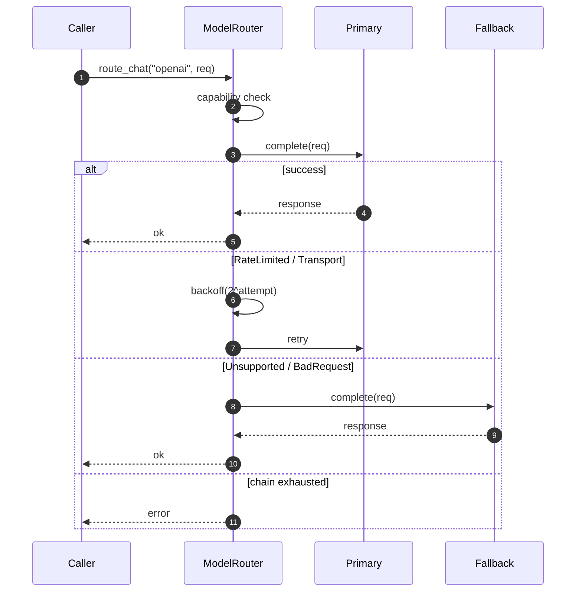

# `ModelRouter`

> Capability check + retry + fallback chain for chat and embedding providers.

`ModelRouter` is the runtime's interface to the provider world. It wraps a `ProviderRegistry`, validates that the requested provider supports the requested capability, retries transient failures with exponential backoff, and walks a configured fallback chain when a primary provider is unavailable.

The full file is `src/runtime/router.rs`.

## Why a router

A provider registry answers "is this name registered?" A router answers "is this name *usable* for this request, right now?" The router encodes the operational semantics that every `AgentRuntime` call needs:

- **Capability check** — does the provider support chat? streaming? the requested tool format?
- **Retry with backoff** — `RateLimited` and `Transport` errors get retried; `Unsupported` and `BadRequest` do not.
- **Fallback chain** — if the primary is unavailable, try the next in the chain. Only when the chain is exhausted does the call fail.
- **Timeout** — the `provider_timeout` policy caps the wall-clock for the call, including retries.

## Construction

```rust
use std::sync::Arc;
use behest::runtime::router::{ModelRouter, RouterPolicy};
use behest::provider::ProviderRegistry;

let registry = Arc::new(ProviderRegistry::from_extensions(&exts));
let policy = RouterPolicy {
    fallbacks: vec!["anthropic".into()],   // primary is the request; on failure, try these
    max_retries: 2,
    initial_backoff: Duration::from_millis(100),
    max_backoff: Duration::from_secs(10),
    ..Default::default()
};
let router = ModelRouter::new(registry, policy);
```

The router **takes an `Arc<ProviderRegistry>`**, not an owned one. This is what allows the runtime to call `ModelRouter::route_chat` while a different task is hot-swapping the registry. The `ExtensionPoint`-backed registry always returns the latest registered `Arc<T>`.

## API

```rust
impl ModelRouter {
    pub fn new(registry: Arc<ProviderRegistry>, policy: RouterPolicy) -> Self;

    pub async fn route_chat(
        &self,
        provider: &ProviderId,
        request: ChatRequest,
    ) -> Result<ChatResponse, RuntimeError>;

    pub async fn route_chat_stream(
        &self,
        provider: &ProviderId,
        request: ChatRequest,
    ) -> Result<ChatStream, RuntimeError>;

    pub async fn route_embedding(
        &self,
        provider: &ProviderId,
        request: EmbeddingRequest,
    ) -> Result<EmbeddingResponse, RuntimeError>;

    pub fn registry(&self) -> &Arc<ProviderRegistry>;
}
```

`route_chat` is the workhorse; the others follow the same retry/fallback pattern.

## Routing flow



The router's `RouterPolicy` controls the chain. The `fallbacks` list is consulted in order; each entry is tried with the same retry loop. A `ProviderError` is only returned after all retries on all fallbacks have been exhausted.

## Capability check

The router looks at the provider's `ProviderCapabilities` (returned by `ChatProvider::capabilities()`) and rejects calls that request an unsupported feature:

```rust
pub struct ProviderCapabilities {
    pub chat: bool,
    pub chat_stream: bool,
    pub embeddings: bool,
    pub tool_calls: bool,
    pub vision: bool,
    // ...
}
```

`route_chat_stream` against a provider without `chat_stream` returns `RuntimeError::Provider(Unsupported)` without contacting the network.

## Retry classification

The router reads `ProviderError::is_retryable()`. The default is:

- `RateLimited { .. }` — retryable
- `Timeout { .. }` — retryable
- `Overloaded { .. }` — retryable
- `Transport { .. }` — retryable
- `Authentication { .. }` — **not** retryable
- `Unsupported { .. }` — not retryable
- `BadRequest { .. }` — not retryable
- `Decode { .. }` — not retryable (the response was malformed; retrying won't help)

Backoff is exponential: `initial_backoff * 2^attempt`, capped at `max_backoff`. A small jitter (±10%) is added to avoid synchronised retries across many parallel runs.

## Worked example

```rust
use std::sync::Arc;
use std::time::Duration;
use behest::runtime::router::{ModelRouter, RouterPolicy};
use behest::provider::ProviderRegistry;

let registry = Arc::new(ProviderRegistry::default());
registry.register_chat(openai_adapter);
registry.register_chat(anthropic_adapter);

let router = ModelRouter::new(
    registry,
    RouterPolicy {
        fallbacks: vec!["anthropic".into()],
        max_retries: 2,
        initial_backoff: Duration::from_millis(200),
        max_backoff: Duration::from_secs(5),
        ..Default::default()
    },
);

let response = router.route_chat(&"openai".into(), req).await?;
// If `openai` is rate-limited, the router retries, then falls back to `anthropic`.
```

## Edge cases

- **Empty fallback chain** — `fallbacks: vec![]` means the router tries the primary and only the primary. Failure is reported as-is.
- **Primary and fallback are the same provider** — the chain is effectively shorter; this is a configuration bug, not a router error.
- **Provider returns `Overloaded` followed by success on retry** — the user sees no failure. The retry is invisible.
- **Capability check passes, but the request asks for an unsupported feature in a non-obvious way** — the provider returns `Unsupported`, which the router does **not** retry. The error is reported.

## Relationship to other components

- **[ProviderRegistry](../../providers/provider-registry)** — the underlying storage.
- **[ChatProvider](../../providers/chat-provider)** — the trait the router routes to.
- **[AgentRuntime](agent-runtime.md)** — the consumer.
- **[Turn FSM](turn-fsm.md)** — invokes the router from the `CallingModel` state.

## See also

- **[ProviderRegistry](../../providers/provider-registry)** — the storage layer.
- **[AgentRuntime](agent-runtime.md)** — the caller.
- **[Turn FSM](turn-fsm.md)** — the loop step that uses the router.
