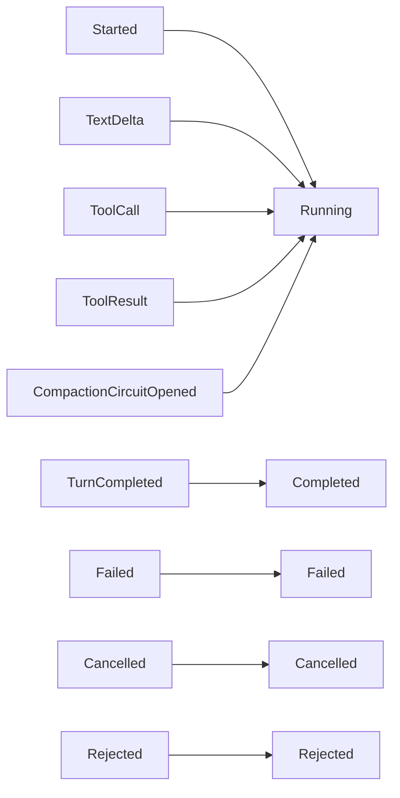

# `RunState`

> The event-sourced projection of a run.

`RunState` is the result of folding a run's `AgentEvent` sequence. It contains the information that an external observer (a UI, a CLI, another service) typically needs: the current status, total token usage, last finish reason, and the timestamp of the last event.

The full file is `src/runtime/state.rs`.

## State

```rust
pub struct RunState {
    pub run_id: RunId,
    pub session_id: Uuid,
    pub status: RunStatus,
    pub iteration: usize,
    pub total_usage: TokenUsage,
    pub last_finish: Option<FinishReason>,
    pub last_error: Option<String>,
    pub last_event_at: DateTime<Utc>,
    pub events: Vec<AgentEvent>,
}

pub enum RunStatus {
    Pending,
    Running,
    Completed,
    Failed,
    Cancelled,
    Rejected,
}
```

## Projection



The fold is deterministic and pure: given the same event sequence, the projection is the same. This is what makes the runtime **crash-recoverable**: replay the events from the `RunStore`, get the same `RunState`.

## API

```rust
impl RunState {
    pub fn project(events: Vec<AgentEvent>) -> Self;
    pub fn from_run_store(store: &dyn RunStore, run_id: RunId) -> impl Future<Output = Result<Self, RuntimeError>>;
    pub fn is_terminal(&self) -> bool;
}
```

`is_terminal` returns `true` for `Completed`, `Failed`, `Cancelled`, `Rejected`.

## Edge cases

- **Empty event sequence** — `status: Pending`, `iteration: 0`, `total_usage: 0`. The run has not started.
- **Out-of-order events** — the projection tolerates reordering for the same `seq` range; a duplicate `seq` is treated as the same event.
- **Truncated sequence** — the projection is computed over whatever events are available. The status is whatever the last event implies; e.g. if the last event is `TextDelta` with no `TurnCompleted`, the status is `Running`.

## See also

- **[AgentRuntime](agent-runtime.md)** — the producer of events.
- **[AgentEvent](../../events/agent-event)** — the event type.
- **[RunStore](../../storage/run-store)** — the persistent store.
