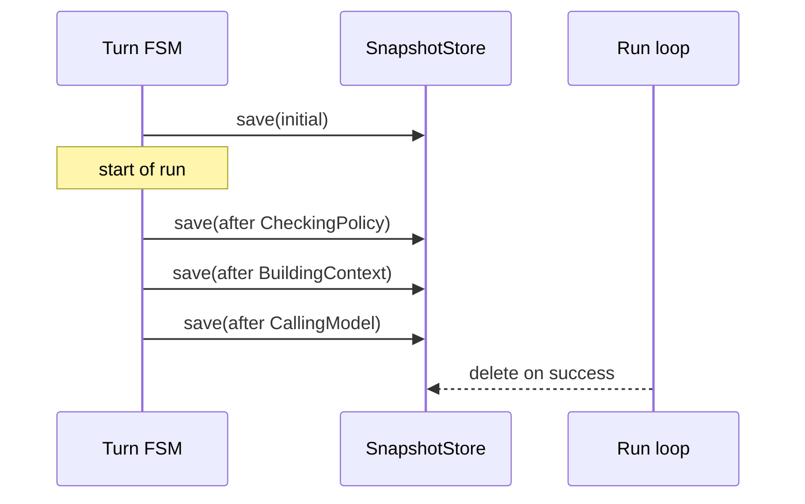

# `SnapshotStore`

> Per-state-transition snapshots for crash recovery.

`SnapshotStore` persists the FSM state at every state transition. A run that crashes between two transitions can be resumed from the most recent snapshot via `AgentRuntime::resume(snapshot)`. Successful runs have their snapshots deleted at the end.

The full file is `src/runtime/snapshot.rs`.

## Backends

- **`MemorySnapshotStore`** — in-memory, default. Used in tests and the `Memory*Component` set.
- **`FileSnapshotStore`** — file-system-backed, default in production. Stores one JSON file per run under the configured root directory.
- **`S3SnapshotStore`** — S3-backed; feature-gated by `object_store`.

## API

```rust
pub trait SnapshotStore: Send + Sync {
    async fn save(&self, run_id: RunId, snapshot: &Snapshot) -> Result<(), SnapshotError>;
    async fn load(&self, run_id: RunId) -> Result<Option<Snapshot>, SnapshotError>;
    async fn delete(&self, run_id: RunId) -> Result<(), SnapshotError>;
    async fn list(&self) -> Result<Vec<RunId>, SnapshotError>;
}

pub struct Snapshot {
    pub run_id: RunId,
    pub state: TurnState,
    pub session_id: Uuid,
    pub provider: ProviderId,
    pub model: ModelName,
    pub iteration: usize,
    pub total_usage: TokenUsage,
    pub context: Option<ChatRequest>,
    pub tool_results: Vec<ToolExecution>,
    pub seq: u64,
    pub created_at: DateTime<Utc>,
}
```

## Lifecycle



Snapshots are **overwritten** on each save; only the most recent survives. The `seq` field is incremented monotonically and is what `RuntimeEventEnvelope::seq` references for replay.

## Resume

`AgentRuntime::resume(snapshot)` reconstructs the `RunState` from the snapshot, advances to the next state, and continues. If the snapshot is for a state that has already been visited, the resume re-enters from the **next** state — there is no re-execution of visited states.

## Edge cases

- **Snapshot write failure** — the transition is **rolled back** (fail-stop). The run is left in the previous state, and `RuntimeError::SnapshotFailed` is returned. The operator can retry.
- **Stale snapshot** — if `load` returns a snapshot whose `seq` is older than the latest event in the `RunStore`, the snapshot is discarded and the run is rebuilt from events. (This is a self-healing path.)
- **Missing snapshot** — `runtime.snapshot(run_id)` returns `None`. The run is in its initial state; there is nothing to resume.

## See also

- **[AgentRuntime](agent-runtime.md)** — the caller.
- **[Turn FSM](turn-fsm.md)** — the orchestrator that drives the snapshot.
- **[RunState](run-state.md)** — the projection rebuilt from the snapshot.
