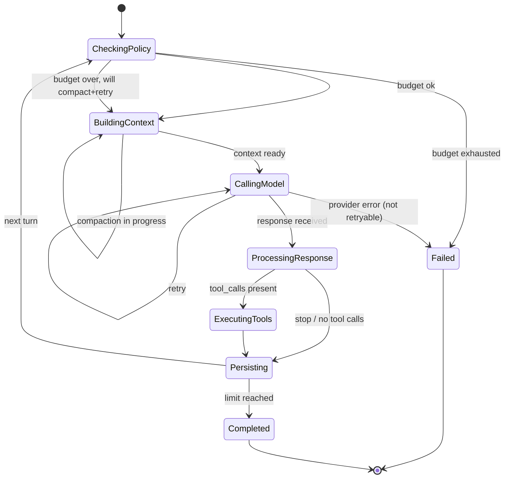

# Turn FSM

> The state machine that decides what happens next at every point in a turn.

The Turn FSM is the deterministic core of the runtime. While `AgentRuntime` is the orchestrator and `Extensions` is the data, the FSM is the **decision** — given the current state and the result of the last step, what happens next? Every state has a well-defined set of legal transitions to other states; the FSM is total, so a turn that does not crash will always terminate.

The full file is `src/runtime/turn.rs`.

## The 6 states



### `CheckingPolicy`

The first state of every turn. The FSM asks the `RuntimePolicy`:

- Have we exceeded `max_iterations`? If yes, fail with `RunStatus::LimitReached`.
- Have we exceeded `max_total_tokens`? If yes, fail with `RunStatus::TokenBudgetExhausted`.
- Otherwise, transition to `BuildingContext`.

### `BuildingContext`

The FSM calls `ContextPipeline::build`, which loads the session history, applies compaction filters, and trims to the token budget. If the build returns a context that is still over budget after compaction, the FSM returns `CompactAndRetry`, which means: invoke the `CompactionService` to summarise the oldest messages, then return to `BuildingContext`.

### `CallingModel`

The FSM delegates to `ModelRouter::route_chat`, which selects a provider, applies capability checks, and handles retry with exponential backoff. The router returns either a `ChatResponse` (or stream) or a `ProviderError`. Transient errors (rate limit, transport) cause a retry; permanent errors (unsupported, bad request) fail the turn.

### `ProcessingResponse`

The FSM inspects the response's `finish_reason` and `tool_calls`:

- If `finish_reason == ToolCalls`, transition to `ExecutingTools`.
- If `finish_reason == Stop` or the iteration limit was reached, transition to `Persisting` (no more turns).
- If `finish_reason == Length` (output truncated), the FSM may continue with a follow-up turn to ask the model to continue, depending on the policy.

### `ExecutingTools`

The FSM delegates to `ToolRuntime`, which validates arguments, applies the per-tool timeout, partitions into concurrent / exclusive execution groups, and dispatches. After all tool calls complete, the FSM records the `ToolExecution` and transitions to `Persisting`.

### `Persisting`

The FSM writes the new messages to the `SessionStore`, appends a `RunEventRecord` to the `RunStore`, and enqueues an async event-persistence job to the `BackgroundJobPool`. If more turns are needed (and the policy allows), the loop returns to `CheckingPolicy`. Otherwise, the run terminates with `Completed` or `Failed`.

## The transition function

```rust
pub fn TurnTransition::resolve(
    state: TurnState,
    outcome: TurnOutcome,
) -> TurnAction;

pub enum TurnState {
    CheckingPolicy,
    BuildingContext,
    CallingModel,
    ProcessingResponse,
    ExecutingTools,
    Persisting,
}

pub enum TurnOutcome {
    Ok,
    PolicyExhausted { reason: PolicyReason },
    ContextReady { context: ChatRequest },
    ContextOverBudget,
    CompactionTriggered,
    ModelResponse(ChatResponse),
    ProviderError(ProviderError),
    ToolCallsPresent,
    NoMoreTurns,
    ToolResultsRecorded,
    Persisted,
}

pub enum TurnAction {
    Continue(TurnState),
    CompactAndRetry,
    BreakLoop,
    Fail(RuntimeError),
}
```

The transition function is **pure** — it does not touch I/O. The orchestrator is responsible for executing the side effect of each transition (e.g. dispatching a tool call) and then calling `resolve` with the next outcome.

## Determinism

Because the transition function is pure, the FSM is deterministic given a sequence of outcomes. This has two consequences:

1. **Replay.** Given a recorded sequence of `TurnOutcome` values (which is what `RunEventRecord` is), the FSM can reproduce the run exactly. This is the basis of the **[Run State](run-state.md)** projection.
2. **Testability.** The FSM can be unit-tested by feeding a sequence of `TurnOutcome` values and asserting the resulting `TurnAction` sequence. There is no I/O to mock.

## Edge cases

- **All states must be visited** — the FSM does not allow skipping a state. A `Persisting` action without a preceding `Persisting` outcome is a bug.
- **Re-entry to `BuildingContext`** — happens only after `CompactAndRetry`. The FSM does not re-enter `CheckingPolicy` until the new context is built; this prevents a runaway compaction loop.
- **Cancellation in any state** — a `Cancel` signal from the run loop short-circuits the transition. The current state's outcome is recorded as `Cancelled`, and the run terminates.

## Relationship to other components

- **[AgentRuntime](agent-runtime.md)** — the orchestrator that drives the FSM.
- **[ModelRouter](model-router.md)** — invoked by `CallingModel`.
- **[ContextPipeline](context-pipeline.md)** — invoked by `BuildingContext`.
- **[CompactionService](compaction-service.md)** — invoked by `CompactAndRetry`.
- **[ToolRuntime](tool-runtime.md)** — invoked by `ExecutingTools`.
- **[RuntimePolicy](runtime-policy.md)** — the input to `CheckingPolicy`.

## See also

- **[AgentRuntime](agent-runtime.md)** — the orchestrator.
- **[ModelRouter](model-router.md)** — the `CallingModel` step.
- **[RunState](run-state.md)** — the projection.
