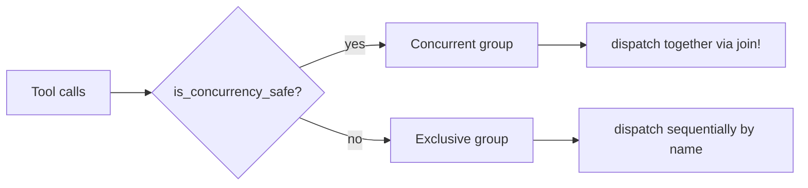
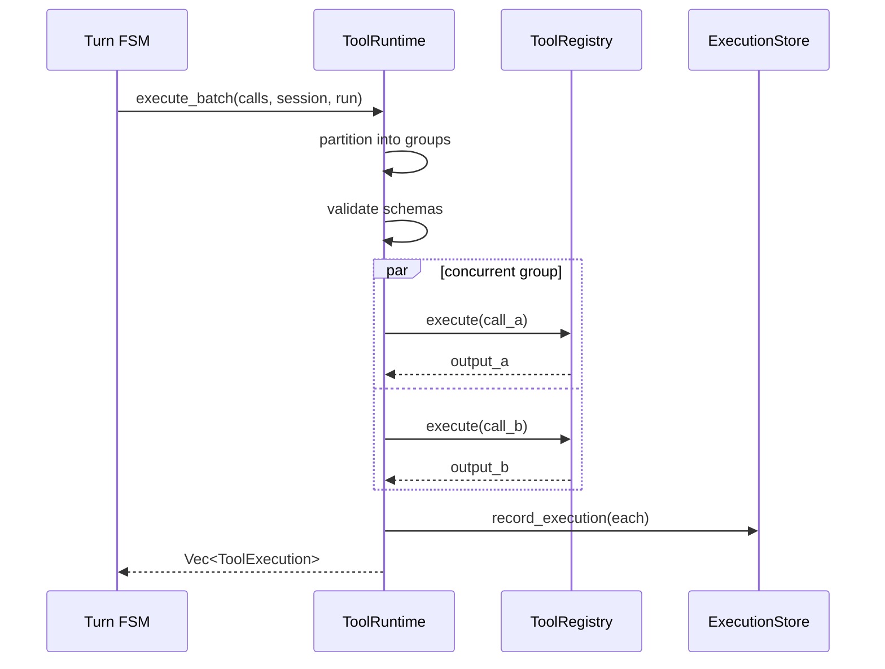

# `ToolRuntime`

> The executor layer around a `ToolRegistry`.

`ToolRuntime` adds schema validation, per-tool timeout, concurrency partitioning, and execution recording on top of the raw `ToolRegistry`. It is the **runtime-level** tool execution engine, used by the Turn FSM's `ExecutingTools` state.

The full file is `src/runtime/tool.rs`.

## Why a separate runtime

`ToolRegistry::execute` is a direct dispatch. `ToolRuntime` adds the operational layer: schema validation via `jsonschema`, per-tool timeout, concurrency partitioning, and execution recording to the `ExecutionStore`.

## API

```rust
impl ToolRuntime {
    pub fn new(registry: Arc<ToolRegistry>, config: ToolRuntimeConfig) -> Self;
    pub async fn execute_batch(
        &self,
        calls: &[ToolCall],
        session_id: Uuid,
        run_id: RunId,
    ) -> Result<Vec<ToolExecution>, RuntimeError>;
}

pub struct ToolRuntimeConfig {
    pub default_timeout: Duration,      // default 30s
    pub validate_schema: bool,           // default true
    pub record_execution: bool,          // default true
    pub max_concurrent: usize,           // default 16
}
```

## Concurrency partitioning



Calls are partitioned into:
1. **Concurrent group** — calls where `is_concurrency_safe == true` → dispatched together.
2. **Exclusive group** — one call per unique tool where `is_concurrency_safe == false` → dispatched sequentially.

This prevents two calls to the same exclusive tool from running simultaneously while allowing unrelated concurrent tools to run in parallel.

## Execution flow



## Timeout

Each tool call is wrapped in `tokio::time::timeout(tool_timeout, registry.execute(call))`. If the timeout fires, the call returns `ToolError::Timeout` and the execution is recorded with `ToolStatus::Timeout`. Other calls in the batch are unaffected.

## Edge cases

- **Schema validation disabled** — `validate_schema: false` skips validation. Use for tools whose schema is dynamic or externally validated.
- **All calls exclusive** — the batch runs sequentially. No parallelism, but no correctness issue.
- **Mixed concurrent/exclusive** — concurrent group runs first, then exclusive group. FIFO within each group.
- **Execution recording disabled** — `record_execution: false` skips the `ExecutionStore` write. Use for high-throughput scenarios.

## See also

- **[Tool Trait](tool-trait.md)** — the base contract.
- **[ToolRegistry](tool-registry.md)** — the raw registry.
- **[Turn FSM](../runtime/turn-fsm.md)** — the `ExecutingTools` state.
