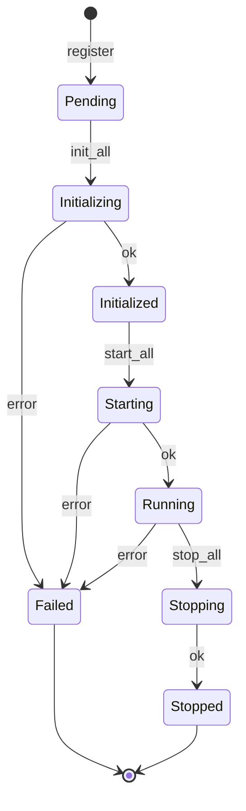

# `ComponentRegistry`

> `Component` 生命周期的依赖感知编排器。

`ComponentRegistry` 是**生命周期编排器**。它持有一个类型化的 `Component` 实例集合，按依赖顺序驱动 `init → start → [serve] → stop`，暴露类型化查找，并聚合健康状态。Trait 提供原语合约；registry 处理**图**。

完整源码在 `src/runtime/registry.rs`。

## 为什么需要单独的 registry

`Component` 是单个实例。实际上，运行时有许多组件，它们彼此依赖：OpenAI adapter 依赖 HTTP client；context pipeline 依赖 session store；snapshot store 依赖 S3 client。按正确顺序启动它们、从部分失败中恢复、把 `Box<dyn AnyComponent>` downcast 回 `Arc<MyType>` 给知道想要什么的调用方 —— 所有这些都住在 registry 里。

## 状态机

每个已注册组件独立地走这个状态机：



`health()` 聚合所有状态：如果每个组件都是 `Running` 则 `healthy`；如果有 `Failed` 但其它都是 `Running` 则 `degraded`；如果没有任何组件是 `Running` 则 `unhealthy`。

## API

```rust
use behest::runtime::registry::ComponentRegistry;
use behest::runtime::lifecycle::ShutdownToken;

let registry = ComponentRegistry::with_shutdown(ShutdownToken::new());

// 按名注册一个 factory；registry 存的是 factory，不是实例。
registry.register_factory("primary.openai", OpenAiChatComponent::NAME, factory)?;

// 驱动生命周期。
registry.init_all().await?;
registry.start_all().await?;

// 类型化查找。
let openai: Arc<OpenAiChatComponent> = registry.get("primary.openai")?;

// 健康。
let aggregate = registry.health().await;  // healthy | degraded | unhealthy

// 优雅关闭。
registry.stop_all().await?;
```

### 错误

```rust
pub enum RegistryError {
    AlreadyRegistered { name: String },
    NotFound { name: String },
    NotInitialized { name: String },
    NotRunning { name: String },
    InitFailed { name: String, source: Box<dyn Error + Send + Sync> },
    StartFailed { name: String, source: Box<dyn Error + Send + Sync> },
    DependencyCycle { cycle: Vec<String> },
    DowncastFailed { name: String, type_name: &'static str },
}
```

变体标了 `#[non_exhaustive]`。

## 依赖顺序

组件通过 `Component::depends_on()` 声明自己的依赖。Registry 在 `init_all` / `start_all` 之前对已注册名字做拓扑排序。环返回 `RegistryError::DependencyCycle { cycle }`，附带出错的节点序列。

```rust
impl Component for ContextPipelineComponent {
    fn depends_on() -> &'static [&'static str] {
        &["store.session.memory", "store.embedding.memory"]
    }
    // ...
}
```

## 类型化 downcast

`registry.get::<MyComponent>("name")` 返回 `Result<Arc<MyComponent>, RegistryError>`。downcast 用 `AnyComponent` 的 `as_any_arc` 方法。Registry 维护一个具体类型名的副表用于诊断。

```rust
let store: Arc<MemorySessionStoreComponent> = registry.get("store.session.memory")?;
let inner: &MemorySessionStore = &store.inner;
```

`TypedAnyComponent` 和 `TypedFactory` 是让 downcast 更顺手的便利封装。

## 热替换：`replace_instance`

`replace_instance` 对运行中的组件执行 drain-aware 原子交换：

```rust
let old = registry.replace_instance("db", new_instance).await?;
// old 是 Arc<dyn AnyComponent> —— 现有的 Arc 克隆保持它存活
```

协议：

1. **验证** —— 组件必须处于 `Running` 状态。
2. **Pre-replace hook** —— 对旧实例调用 `pre_replace`（信号它将停止接受新流量）。
3. **启动新实例** —— 对新实例调用 `start`。如果失败，旧实例保持不变。
4. **原子交换** —— 更新 registry 槽位。新的查找返回新实例。
5. **Post-replace hook** —— 对旧实例调用 `post_replace`（尽力而为；错误会被记录但不会回滚）。

返回旧的 `Arc<dyn AnyComponent>`。其他任务持有的现有 `Arc` 克隆保持旧实例存活直到被 drop（通过引用计数自然 drain）。对于显式 drain 跟踪，将结果包装在 [`DrainGuard`](drain-guard.md) 中。

### 错误

| 条件 | 变体 |
|------|------|
| 名称未注册 | `RegistryError::NotFound` |
| 组件不在 `Running` 状态 | `RegistryError::Reload` |
| `pre_replace` 或 `start` 失败 | `RegistryError::Reload` |

## 完整示例

```rust
use std::sync::Arc;
use behest::runtime::registry::ComponentRegistry;
use behest::runtime::factory_registry::FactoryRegistry;
use behest::runtime::lifecycle::ShutdownToken;
use behest::runtime::components::{
    default_factory_registry, OpenAiChatComponent,
    MemorySessionStoreComponent,
};

#[tokio::main]
async fn main() -> Result<(), Box<dyn std::error::Error>> {
    let registry = ComponentRegistry::with_shutdown(ShutdownToken::new());
    let factories: FactoryRegistry = default_factory_registry();

    // 把同一个 factory 注册到两个名字下。
    let ctx = registry.context();
    registry.register_factory(
        "openai.primary",
        OpenAiChatComponent::NAME,
        factories.get("provider.openai.chat")?,
    )?;
    registry.register_factory(
        "store.session.default",
        MemorySessionStoreComponent::NAME,
        factories.get("store.session.memory")?,
    )?;

    registry.init_all().await?;
    registry.start_all().await?;
    assert!(registry.health().await.is_healthy());
    Ok(())
}
```

## 边界情况

- **部分 init 失败** —— 如果组件 B 的 `init` 失败，registry 停止。已经成功的组件停留在 `Initialized` 状态；修复后可以再调一次 `init_all`。失败的组件通过 `health()` 上报。
- **幂等 start** —— 连续调用两次 `start_all` 是 no-op。`stop_all` 之后再调 `start_all` 也是 no-op（状态机已经过这个转移）。
- **未初始化的 stop** —— 对从未到达 `Running` 的组件调 `stop_all` 是 no-op，不报错。
- **`depends_on` 中有环** —— 作为 `RegistryError::DependencyCycle` 返回。环是拓扑排序的结果，按回到起点的顺序。
- **缺失依赖** —— 如果 `Component::depends_on` 返回 `["nonexistent"]`，`init_all` 返回 `RegistryError::NotFound { name: "nonexistent" }`。依赖必须已注册。

## 与其它组件的关系

- **[Component](component-trait.md)** —— 组件实现的 trait。
- **[FactoryRegistry](factory-registry.md)** —— 用来填充 registry 的 `kind` → factory 映射。
- **[Extensions](extensions-facade.md)** —— 运行时外观，从同一份底层实例读取。
- **[ExtensionPoint](extension-point.md)** —— 存储原语；registry 可以用它作为已注册组件的存储。

## 另见

- **[Component](component-trait.md)** —— 生命周期合约。
- **[FactoryRegistry](factory-registry.md)** —— 填充 registry。
- **[Extensions](extensions-facade.md)** —— 运行时视图。
- **[DrainGuard](drain-guard.md)** —— 替换后的显式 drain 跟踪。
