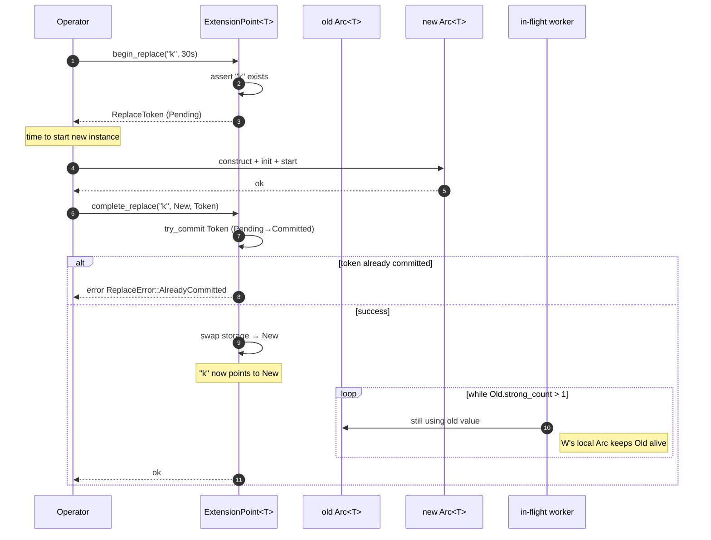
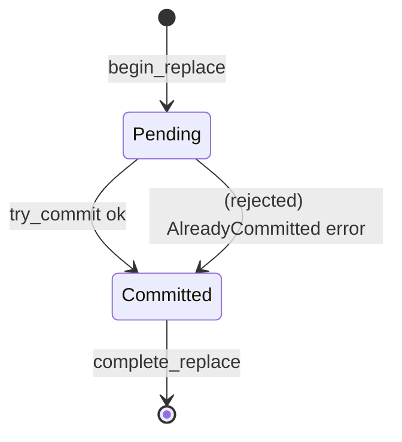

# Drain-aware Replace

> 可热插拔运行时元素的两阶段原子替换协议。

当你在 `ExtensionPoint<T>` 中替换已注册的 `Arc<T>` 时，朴素的 `HashMap::insert` 会立刻 drop 旧值。如果请求正在旧实例上执行，**它会被突然中断** —— 通常表现为连接断开、tool call 返回 `ProviderError::Transport`，更糟的是状态损坏。

drain-aware replace 协议给旧实例**完成手头工作**的时间，再覆盖 storage 槽位。默认期限 30 秒。到达期限后，无论 in-flight 请求是否仍在进行，替换都继续；旧值"泄露"在内存里，直到它最后一个外部持有者 drop 它。

完整源码在 `src/runtime/extension.rs`（协议实现）和 `src/runtime/replace.rs`（token）。

## 为什么存在

旧版 `ProviderRegistry::register_chat_arc` 会**静默替换**旧 provider。生产中由此带来两种失败模式：

1. **in-flight 请求被中断。** 已经发出模型请求的 `runtime.run()`，在替换之后会去消费**新** provider 的 stream，但请求 id 是发给**旧** provider 的。新 provider 返回 `404 Not Found`；调用失败。
2. **半应用的 tool call。** 已 dispatch 到旧 store、正在写入中的 tool 执行会突然发现连接被断开，结果由新 store 以同样的 key 持久化下一个请求。

drain 协议消除了这两种常见失败模式（30 秒内能完成的 in-flight 请求）。

## 阶段

协议是严格的两阶段提交。



### 阶段 1 — `begin_replace`

```rust
let token = exts.chat_providers.begin_replace("openai", Duration::from_secs(30))?;
```

它做的事：

- 断言 name 在 extension point 中存在。否则返回 `ExtensionError::NotFound`。
- 分配一个 `Pending` 状态的 `ReplaceToken`。Token 实现了 `Clone`，可以移入 deadline 任务。
- **不**改动 storage map。在 `complete_replace` 执行之前，`get("openai")` 仍返回旧 `Arc<T>`。

这一阶段刻意廉价。Operator 用这个窗口并行构造、启动新实例，旧实例同时继续服务流量。

### 阶段 2 — `complete_replace`

```rust
let ep_arc: Arc<ExtensionPoint<dyn ChatProvider>> = Arc::clone(&exts.chat_providers);
ep_arc.complete_replace("openai", Arc::new(new_openai), token).await?;
```

它做的事：

- 原子 commit token（`Pending → Committed`）。如果 token 已被 commit，返回 `ReplaceError::AlreadyCommitted`。
- 原子地把 storage 槽位切换为指向**新**值。**新请求现在看到新值。**
- 10ms 轮询**旧**值的 `Arc::strong_count`：
  - 若 `strong_count == 1`，唯一引用就是 storage 槽位 —— 但我们刚刚通过 swap 移除了它，意味着旧值完全被释放。
  - 若 `strong_count > 1`，外部持有者仍在使用。继续等。
- 若 `drain_timeout`（默认 30s）到达时 `strong_count > 1`，替换仍然完成；旧值继续留在内存里，直到它的最后一个外部持有者 drop 它。



## `ReplaceToken`

Token 是一次性的、可克隆的句柄。

```rust
#[derive(Debug, Clone)]
pub struct ReplaceToken {
    state: Arc<AtomicBool>,
    timeout: Duration,
}

impl ReplaceToken {
    pub fn new(timeout: Duration) -> Self;
    pub fn state(&self) -> ReplaceState;        // Pending | Committed
    pub fn timeout(&self) -> Duration;
    pub(crate) fn try_commit(&self) -> Result<(), ReplaceError>;
}
```

`ReplaceToken` **故意不与具体 ExtensionPoint 耦合**。可以在任务间自由移动。典型模式：

```rust
let token = exts.chat_providers.begin_replace("openai", Duration::from_secs(15))?;
let deadline_token = token.clone();
let deadline = tokio::spawn(async move {
    tokio::time::sleep(Duration::from_secs(15)).await;
    // 如果走到这里 swap 还没 commit，输出 warning。
    if deadline_token.state() == ReplaceState::Pending {
        tracing::warn!("hot swap deadline reached, swap not yet committed");
    }
});

exts.chat_providers
    .complete_replace("openai", Arc::new(new_openai), token)
    .await?;
```

## API

```rust
impl<T: ?Sized> ExtensionPoint<T> {
    pub fn begin_replace(
        &self,
        name: &str,
        drain_timeout: Duration,
    ) -> Result<ReplaceToken, ExtensionError>;

    pub async fn complete_replace(
        self: Arc<Self>,
        name: &str,
        new_value: Arc<T>,
        token: ReplaceToken,
    ) -> Result<(), ExtensionError>;
}
```

`complete_replace` 接受 `self: Arc<Self>`，因为实现可能需要在 `await` 期间保持 extension point 存活。大多数调用者本来就有 `Arc<ExtensionPoint<T>>`，因为他们在一个持有 `Arc<ExtensionPoint<T>>` 的 `Component` 或 `ComponentRegistry` 内部。

## 完整示例 —— provider 热替换

```rust
use std::sync::Arc;
use std::time::Duration;
use behest::runtime::extensions::Extensions;
use behest::runtime::replace::DEFAULT_DRAIN_TIMEOUT;

async fn swap_openai_provider(
    exts: Arc<Extensions>,
    new_adapter: Arc<dyn behest::provider::ChatProvider>,
) -> Result<(), Box<dyn std::error::Error>> {
    // 阶段 1：宣告替换。旧 `openai` 仍在服务。
    let token = exts.chat_providers
        .begin_replace("openai", DEFAULT_DRAIN_TIMEOUT)?;

    // 并行构造并启动新 adapter。
    // （比如通过 OpenAI 的 /v1/models 握手。）
    // new_adapter.warmup().await?;

    // 阶段 2：commit。新请求走 new_adapter；旧实例被 drain。
    exts.chat_providers
        .complete_replace("openai", new_adapter, token)
        .await?;
    Ok(())
}
```

## 边界情况与错误语义

- **Name 不存在** —— `begin_replace` 返回 `ExtensionError::NotFound`。不能"替换一个不存在的东西"；先 `register`。
- **Token 已被 commit** —— 用同一个 token 第二次调用 `complete_replace` 返回 `ReplaceError::AlreadyCommitted`。这能防止 `select!` 中两个任务同时尝试完成 swap。
- **两阶段间 name 消失** —— 如果在 `begin_replace` 与 `complete_replace` 之间调用了 `unregister("k")`，第二阶段返回 `ExtensionError::NotFound`。这是有意的：并发的 unregister 意味着 Operator 改变了主意，swap 应中止。
- **Drain 超时** —— swap 仍然完成；旧值继续在内存里，直到最后一个外部持有者 drop 它。**不**为此返回错误；这是高负载下的正常情况。调用方可以检查 `begin_replace` 与 `complete_replace` 之间的 wall-clock 时长来检测。
- **Swap 时 strong_count 为 0** —— 如果 storage 槽位是唯一引用（比如没有 in-flight 请求，也没有外部 `Arc<T>`），swap 立即完成。
- **Drain 阶段高竞争** —— drain 循环每 10ms 轮询一次；上千 in-flight 请求下开销可忽略。drain **不**做通知；如果需要 push 式完成，自己维护一个计数器。

## 与其它组件的关系

协议完全在 `ExtensionPoint` 中实现；`Extensions` 只是通过 13 个 `ExtensionPoint` 字段暴露它。消费者是 `ManagedRuntime::reload`，使用这个协议来 swap provider、store 以及任何其它可热插拔的组件，避免 in-flight 流量被丢弃。

- **[ExtensionPoint](extension-point.md)** —— 协议实现所在。
- **[Extensions](extensions-facade.md)** —— 通过 13 个 `ExtensionPoint` 字段暴露协议。
- **[ManagedRuntime](../ops/managed-runtime.md)** —— 高层 `reload(name, new_cfg)` API。
- **[Hot Reload](../ops/hot-reload.md)** —— 完整运维故事：pre-replace 钩子、post-replace 钩子、drain 超时。

## 另见

- **[ExtensionPoint](extension-point.md)** —— 存储原语。
- **[ManagedRuntime](../ops/managed-runtime.md)** —— 计划的顶层编排器。
- **[Hot Reload](../ops/hot-reload.md)** —— 面向 Operator 的热重载指南。
