# `Extensions`

> 跨每一种可插拔运行时元素的可组合、热插拔 facade。

`Extensions` 是运行时其余部分读取的中央结构。每一种可插拔类别 —— chat provider、embedding provider、工具、上下文适配器、session store、execution store、embedding store、artifact store、run store、event publisher、session data store、runtime event store、snapshot store —— 都以 `ExtensionPoint<T>` 的形式在此暴露。Operator 通过按名注册实现来组装运行时，并可在运行时热替换任何已注册的实例。

完整源码位于 `src/runtime/extensions.rs`。

## 为什么需要 facade

在旧版布局里，`AgentRuntime` 的构造器接收**十一个**独立参数 —— provider registry、session store、execution store、embedding store、artifact store、run store、tool registry、context pipeline、snapshot store、runtime event store、runtime stream adapter。每一个都必须由调用方按正确顺序、带着正确的约束构造出来，并且**每个 runtime 的 public 方法都必须查找对应的那一个**。代价是真实的：

- `AgentRuntime` 的 API 表面有 11 个构造参数；`into_runtime` builder 也相应地宽。
- 热替换只是事后补丁。替换一个 provider 需要完整重建 `AgentRuntime`。
- 测试即使只关心一个维度，也得接好全部 11 个协作者。
- 横切字段（snapshot store、event store）必须在每一层都穿透。

`Extensions` facade 是**单一事实源**：一个由 13 个 `ExtensionPoint` 字段组成的结构，克隆廉价，并发读。`AgentRuntime::new` 接受一个 `Arc<Extensions>` 和一个 `RuntimePolicy`。只关心单个维度的测试，只需注册一个字段，其余留空。

## 定义

```rust
use crate::provider::{ChatProvider, EmbeddingProvider};
use crate::runtime::extension::ExtensionPoint;
use crate::store::{ArtifactStore, EmbeddingStore, ExecutionStore, SessionStore};
use crate::tool::Tool;
use crate::context::ContextAdapter;
use crate::runtime::store::RunStore;
use crate::runtime::event_store::RuntimeEventStore;
use crate::runtime::invocation::SessionDataStore;
use crate::runtime::snapshot::SnapshotStore;
use crate::queue::EventPublisher;   // feature = "queue"

#[derive(Clone, Default)]
pub struct Extensions {
    pub chat_providers:         ExtensionPoint<dyn ChatProvider>,
    pub embedding_providers:    ExtensionPoint<dyn EmbeddingProvider>,
    pub tools:                  ExtensionPoint<dyn Tool>,
    pub context_adapters:       ExtensionPoint<dyn ContextAdapter>,
    pub session_stores:         ExtensionPoint<dyn SessionStore>,
    pub execution_stores:       ExtensionPoint<dyn ExecutionStore>,
    pub embedding_stores:       ExtensionPoint<dyn EmbeddingStore>,
    pub artifact_stores:        ExtensionPoint<dyn ArtifactStore>,
    pub run_stores:             ExtensionPoint<dyn RunStore>,
    #[cfg(feature = "queue")]
    pub event_publishers:       ExtensionPoint<dyn EventPublisher>,
    pub session_data_stores:    ExtensionPoint<dyn SessionDataStore>,
    pub runtime_event_stores:   ExtensionPoint<dyn RuntimeEventStore>,
    pub snapshot_stores:        ExtensionPoint<dyn SnapshotStore>,
}
```

## 构造

按控制粒度递增的三种惯用路径：

### 1. `Extensions::default()` —— 全新构造

```rust
use behest::runtime::extensions::Extensions;

let exts = Extensions::default();
exts.chat_providers.register("openai", Arc::new(my_openai_adapter))?;
exts.session_stores.register("memory", Arc::new(MemorySessionStore::new()))?;
```

`Default` 产生一个空的 facade。你注册自己关心的字段，其余保持空。运行时容忍空字段：空的 `chat_providers` 意味着 runtime 无法完成 chat turn，但它仍然会构造并发射状态转换事件。

### 2. 从 `AgentConfig`

```rust
let exts = config.into_extensions().await?;  // 异步；可能打开连接。
let runtime = AgentRuntime::new(Arc::new(exts), policy);
```

`AgentConfig::into_extensions` 会遍历加载的配置，通过 `FactoryRegistry` 为每个条目构造对应的 `Component`，执行 `init` 与 `start`，再把得到的实例按配置里定义的名字注册。这是 95% 用户的路径。

### 3. 程序化、细粒度

```rust
let mut exts = Extensions::default();
exts.chat_providers.register_or_replace("primary",   Arc::new(openai))?;
exts.chat_providers.register_or_replace("fallback",  Arc::new(anthropic))?;
exts.session_stores.register_or_replace("default",  Arc::new(pg_store))?;
exts.snapshot_stores.register_or_replace("default",  Arc::new(s3_snapshots))?;
// 在 facade 之上构造 router。
let router = ModelRouter::new(Arc::new(ProviderRegistry::from_extensions(&exts)), router_policy);
let runtime = AgentRuntime::new(Arc::new(exts), policy);
```

## 线程与所有权

```mermaid
flowchart LR
  subgraph "Crate 内部代码"
    A["AgentRuntime"]
    B["ModelRouter"]
    C["ContextPipeline"]
    D["ToolRuntime"]
    E["RuntimeStore"]
  end
  subgraph "Extensions"
    EP1["chat_providers"]
    EP2["embedding_providers"]
    EP3["session_stores"]
    EP4["runtime_event_stores"]
  end
  A -->|reads| EP1
  A -->|reads| EP3
  B -->|reads| EP1
  C -->|reads| EP2
  D -->|reads| EP1
  E -->|reads| EP3
  E -->|reads| EP4
  style Extensions fill:#1A1A1A,stroke:#7C3AED
```

每个字段都是一个 `ExtensionPoint<T>`，内部以 `Arc` 支撑。克隆 `Extensions` 廉价（13 个 `Arc` 指针的栈到栈拷贝）。所有克隆观察到同一组已注册条目。



Runtime 内部持有一个 `Arc<Extensions>`，并通过 `AgentRuntime::extensions()` 暴露出来。Operator 和可观测性代码因此可以直接检视当前插件集合，无需走 runtime 的方法：

```rust
let exts = runtime.extensions();
for name in exts.chat_providers.names() {
    tracing::info!(provider = %name, "registered");
}
```

## 已填充分类

`Extensions::populated_categories()` 返回至少有一条记录的字段数。对测试断言很有用：

```rust
let exts = Extensions::default();
exts.chat_providers.register("openai", Arc::new(openai))?;
exts.session_stores.register("memory", Arc::new(MemorySessionStore::new()))?;
assert_eq!(exts.populated_categories(), 2);
```

## 通过 facade 进行热替换

由于每个字段都是 `ExtensionPoint`，热替换的接口是统一的。runtime 本身并不观察替换事件；底层的 `ExtensionPoint` 处理 live-reference 和 drain 逻辑。

```rust
// 原子替换：换掉存储的 Arc<T>，拿到旧的 Arc。
// 新的 get() 调用返回新实例；持有旧 Arc<T> 的 in-flight 调用
// 在 drop 之前继续使用旧实例。
let old = exts.chat_providers.replace("openai", Arc::new(new_openai))?;
drop(old);  // 或持有并轮询 Arc::strong_count 等待 drain
```

`ManagedRuntime::reload` 的自然 drain 流程见 **[Drain-aware Replace](drain-aware-replace.md)**。

## 完整示例 —— 最小可组合 runtime

```rust
use std::sync::Arc;
use behest::runtime::extensions::Extensions;
use behest::runtime::agent::AgentRuntime;
use behest::runtime::policy::RuntimePolicy;
use behest::provider::ProviderId;

#[tokio::main]
async fn main() -> Result<(), Box<dyn std::error::Error>> {
    let mut exts = Extensions::default();

    // 注册一个名为 "primary" 的 chat provider。
    let openai = build_openai_chat_adapter().await?;
    exts.chat_providers.register("primary", Arc::new(openai))?;

    // 注册一个内存 session store。
    exts.session_stores
        .register("memory", Arc::new(MemorySessionStore::new()))?;

    let runtime = AgentRuntime::new(Arc::new(exts), RuntimePolicy::default());
    let out = runtime.run_one_shot("primary", "Hello, world.").await?;
    println!("{}", out);
    Ok(())
}
```

没有全局注册表；没有 `AgentConfig`；没有 builder。Runtime **只是**一个结构加一个 policy，唯一的协作者就是 facade。

## 边界情况与错误语义

- **空 facade** —— `Extensions::default()` 产生一个完全空的 facade。基于它构造 `AgentRuntime` 成功；调用 `runtime.run` 返回 `ProviderError::Unsupported`，因为没注册任何 chat provider。这是预期的失败模式：用户立刻知道缺什么。
- **同名字段内重复** —— 第二次 `register` 返回 `ExtensionError::AlreadyRegistered`。要用 `register_or_replace` 静默覆盖。
- **跨字段同名** —— 不会在 `chat_providers` 与 `embedding_stores` 之间做命名空间交叉检查。`chat_providers` 中的 `"primary"` 与 `embedding_stores` 中的 `"primary"` 互不相关。
- **Drop 语义** —— 当最后一个 `Arc<Extensions>` 被 drop 时，内部 `ExtensionPoint` 一起被 drop。它们各自持有每个已注册值的 `Arc<T>`。这些值会一直存活，直到最后一个外部持有者释放。换言之，**drop `Extensions` 不会急切 drop 已注册的实现**。
- **克隆** —— `Clone` 由 `#[derive(Clone)]` 派生，产生一个字段相同的 `Arc` 支撑结构。克隆与原对象是无法区分的、同一份底层数据的观察者。
- **Feature gate** —— `event_publishers` 标了 `#[cfg(feature = "queue")]`。`Default` impl 在两种变体下都能编译：feature 开启时包含该字段，feature 关闭时则没有。`Default` 派生自动处理两种情况。

## 与其它组件的关系

`Extensions` 是数据结构；其它一切都从它读。

- **[`ExtensionPoint<T>`](extension-point.md)** —— 底层存储原语。
- **[`AgentRuntime`](../runtime/agent-runtime.md)** —— 持有一个 `Arc<Extensions>`，把每个协作者的查找都委托给它。
- **[`FactoryRegistry`](factory-registry.md)** —— 从配置填充 `Extensions` 用的 `kind` → factory 映射。
- **[`ComponentRegistry`](component-registry.md)** —— 与 `Extensions` 配对；registry 持有生命周期，facade 持有存储。

## 另见

- **[ExtensionPoint](extension-point.md)** —— 存储原语。
- **[Drain-aware Replace](drain-aware-replace.md)** —— 原子替换与自然 `Arc` drain。
- **[AgentRuntime](../runtime/agent-runtime.md)** —— facade 的消费者。
- **[FactoryRegistry](factory-registry.md)** —— 从配置填充 facade。
- **[ManagedRuntime](../ops/managed-runtime.md)** —— 计划的顶层编排器。
