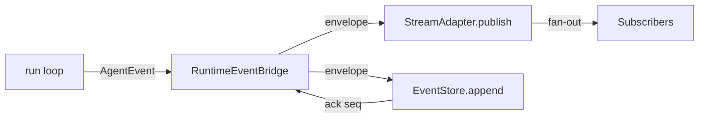

# `RuntimeEventBridge`

> 把 run 循环桥接到事件管线。

`RuntimeEventBridge` 是把 run 循环发射的 `AgentEvent` 值转换为 `RuntimeEventEnvelope`、再发布到 `RuntimeStreamAdapter` 并追加到 `RuntimeEventStore` 的进程内组件。它是运行时与事件管线的单一接触点。

完整源码在 `src/runtime/subscription.rs`（`RuntimeEventBridge` 结构体）。

## API

```rust
impl RuntimeEventBridge {
    pub fn new(
        store: Arc<dyn RuntimeEventStore>,
        adapter: Arc<dyn RuntimeStreamAdapter>,
        session_map: SessionMap,
    ) -> Self;

    pub fn handle(&self) -> RuntimeEventBridgeHandle;
    pub async fn emit(&self, request: EmitRequest) -> Result<(), RuntimeEventBridgeError>;
}

pub struct EmitRequest {
    pub kind: EventKind,
    pub room: RuntimeRoom,
    pub dedup_key: Option<String>,
    pub max_buffer: usize,
}
```

## 流程



`emit` 是 fire-and-forget；事件发布到 adapter 并追加到 store 后即返回。失败被记录并计数，不返回给 run 循环。

## 另见

- **[AgentEvent](agent-event.md)** —— 输入。
- **[RuntimeEventStore](runtime-event-store.md)** —— 持久接收端。
- **[RuntimeStreamAdapter](runtime-stream-adapter.md)** —— live 扇出。
