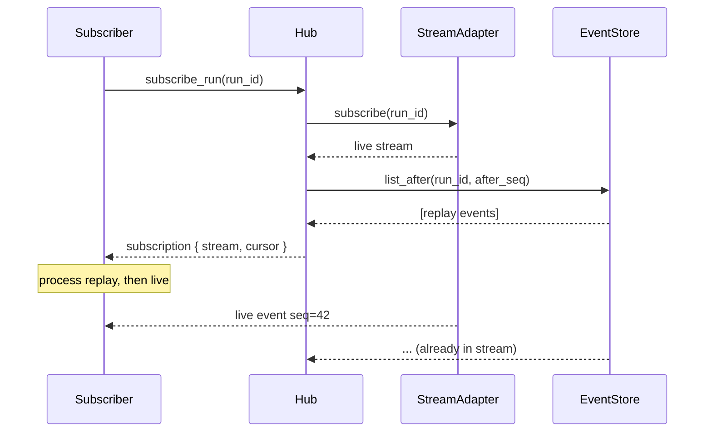

# `RuntimeSubscriptionHub`

> Live-then-replay 订阅语义。

`RuntimeSubscriptionHub` 是订阅事件的推荐方式。它先打开 **live** 订阅（这样不会丢失事件），再从 `RuntimeEventStore` **回放**订阅者已经看过的最后一个 `seq`。订阅者通过 `seq` 对重叠事件去重。

完整源码在 `src/runtime/subscription.rs`。

## API

```rust
impl RuntimeSubscriptionHub {
    pub fn new(store: Arc<dyn RuntimeEventStore>, adapter: Arc<dyn RuntimeStreamAdapter>) -> Self;
    pub fn subscribe_run(&self, run_id: RunId) -> RuntimeSubscription;
    pub fn subscribe_session(&self, session_id: Uuid) -> RuntimeSubscription;
    pub fn subscribe_provider(&self, provider: ProviderId) -> RuntimeSubscription;
}

pub struct RuntimeSubscription {
    pub stream: BoxRuntimeEventStream,
    pub cursor: u64,
}
```

## Live-then-replay 顺序



订阅者看到：replay（最旧的在前），然后 live（最新的）。按 `seq` 的重复由订阅者去重。

## 另见

- **[RuntimeEventStore](runtime-event-store.md)** —— 持久路径。
- **[RuntimeStreamAdapter](runtime-stream-adapter.md)** —— live 路径。
- **[RuntimeInvocation](runtime-invocation.md)** —— 高层 facade。
