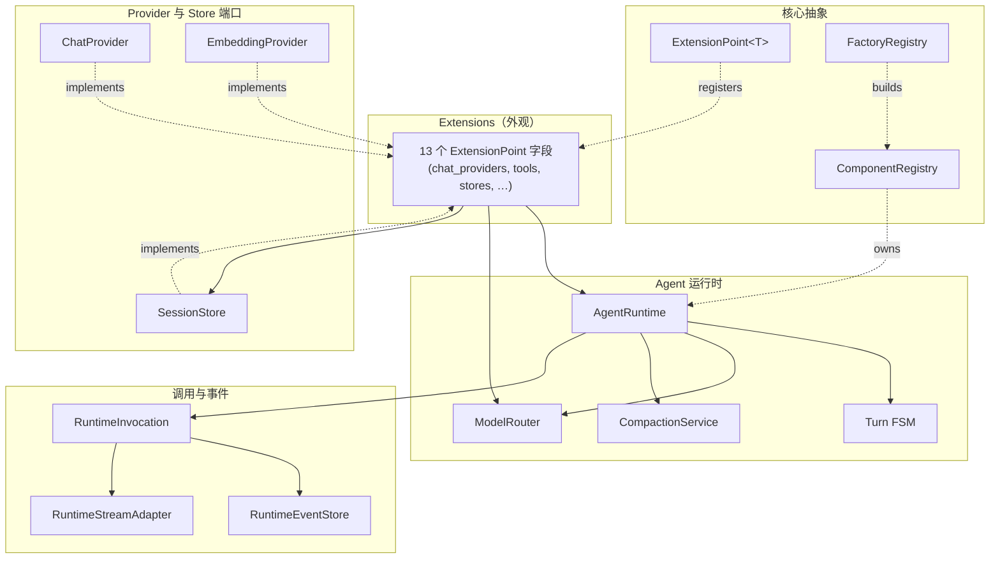

# 概览

> **behest** /bɪˈhest/ — *n.* a person's orders or command.
> 在用户的命令下，agent 行事。

`behest` 是一个 Rust 原生的 agent 运行时库。它提供与 provider 无关的合约：chat、streaming、tool calling、embeddings、持久化、队列、RAG、可观测性，以及可选的 gRPC server —— 由一组小而可热插拔的组件组装而成，可在运行时组合、替换与重载。

本 crate 面向那些需要对模型 provider、工具执行、持久化与运维边界进行**显式控制**的系统 —— 而不是不透明的"agent 框架"魔法。

## 为什么是 behest

agent 运行时的核心不是"自主意识"，而是**受控的委派**：用户发出意图，系统在明确的边界内组合上下文、调用模型、执行工具、持久化状态、发布事件 —— 可审计、可恢复、可约束、可替换。

这个名字刻意回避了膨胀的隐喻。它只陈述一个工程事实：

> 工具调用、流式响应、记忆、队列、RAG、快照 —— 所有机制都因为有人下了命令而存在。

## 设计目标

- **Rust-native first** — 类型化 API、显式错误、不隐藏运行时假设。
- **Provider-neutral core** — OpenAI、Anthropic、本地模型、代理或内部 provider 都可以实现同一份合约。
- **Streaming-first runtime** — agent 循环围绕流式模型事件设计，必要时提供非流式回退。
- **Typed tool boundary** — 工具由 JSON Schema 描述，通过显式注册表执行。
- **Pluggable persistence** — 默认内存，外部 store 通过 feature flag 启用。
- **Operational surface** — 事件发布、快照、session gate、压缩、重试策略，以及可选的 gRPC server。
- **Small public API** — 以基础原语代替框架式膨胀。

## 组件图

behest 由一组分层的小组件构成。下图中的方框是**核心抽象**；其余都是它们的具体应用。

每个方框都是一篇独立的组件文档。从任何一处开始；每页底部的"相关组件"会带你走完这张图。

## 你能构建什么

| 能力 | 涵盖内容 |
|---|---|
| Provider 合约 | `ChatProvider`、`EmbeddingProvider`、请求/响应模型、流式事件、provider 能力 |
| Provider 注册表 | chat 与 embedding provider 的内存路由 |
| Chat 模型类型 | 消息、内容片段、tool call、响应格式、token 用量、结束原因 |
| Tool 运行时 | `Tool`、`FunctionTool`、`ExternalTool`、`ToolRegistry`、schema 生成、执行分发 |
| Agent 运行时 | 上下文构建、模型调用、tool 循环、session 持久化、事件发射 |
| Runtime 安全 | session gate、runtime policy、输入准入、doom-loop 检测、tool 输出截断 |
| 存储 | 内存 store、Redis、SQLx、MongoDB、SurrealDB、对象存储、Qdrant embedding |
| 上下文与 RAG | 上下文适配器、static/function 适配器、可选 RAG 适配器 |
| 队列 | 通过 NATS 或 Redis Streams 的可选事件发布 |
| 配置 | builder、文件配置、环境变量加载、密钥间接引用 |
| Server | `server` feature 后面的可选 gRPC server |
| 可观测性 | tracing 与可选的 OpenTelemetry 集成 |

## 下一步

:::callout{type=tip}
如果你是第一次接触 behest，先读 **[快速开始](quick-start.md)** 完成安装并跑通第一个 turn。
:::

文档分为 10 个分组。选一个入口：

- **[核心抽象](../core/extension-point.md)** — `ExtensionPoint`、`Extensions`、`Component`、`FactoryRegistry`，可组合的基底。
- **[Agent 运行时](../runtime/agent-runtime.md)** — 流式优先的 FSM，驱动每一个 turn。
- **[调用与事件](../events/runtime-invocation.md)** — 与传输无关的 emit/on 外观。
- **[上下文与工具](../tools/tool-trait.md)** — 工具层级、作用域与 RAG 适配器。
- **[Provider](../providers/chat-provider.md)** — provider 端口、消息类型与具体适配器。
- **[存储](../storage/storage-overview.md)** — store trait 与 feature-gated backend。
- **[配置与横切关注点](../config/agent-config.md)** — 配置、错误、可观测性、队列、gRPC。
- **[运维](../ops/managed-runtime.md)** — `ManagedRuntime` 与热重载协议（计划中）。
- **[参考](../ref/api-reference.md)** — 完整 API 索引、开发指南、迁移说明。
