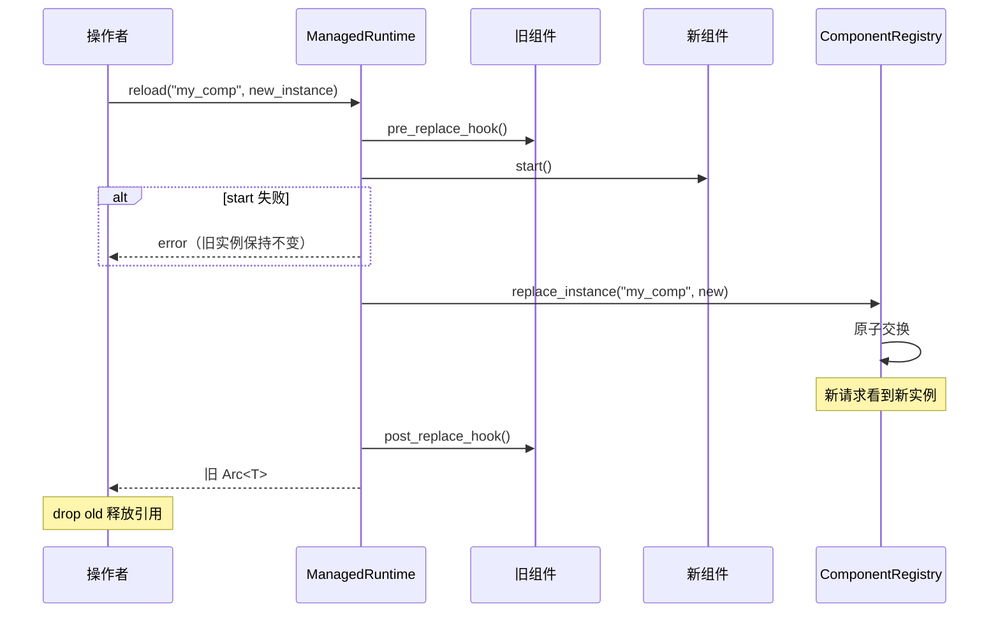

# 热替换

> 在不中断在途流量的情况下替换运行中的组件。

热替换是基于 `ComponentRegistry::replace_instance` 原语和 `Component` 生命周期钩子的操作者层面协议。允许在运行时服务请求的同时替换 chat provider、store 或任何其他 `Component`。

入口点是 `ManagedRuntime::reload`：

```rust
let old = managed.reload::<MyComponent>("my_comp", new_instance).await?;
```

## 协议



1. **Pre-replace hook** — 旧实例信号它将停止接受新请求。在途请求继续。
2. **新实例启动** — 调用新组件的 `start()`。如果失败，旧实例保持不变并返回错误。
3. **交换** — `ComponentRegistry::replace_instance` 原子交换存储槽。新请求现在看到新实例。
4. **Post-replace hook** — 旧实例信号它已被替换。尽力而为；失败会被记录但不会中止交换。
5. **返回旧 Arc** — 调用者收到旧 `Arc<T>`。其他任务持有的现有 `Arc<T>` 克隆保持旧实例存活直到被 drop（通过 `Arc` 引用计数自然 drain）。

## 组件钩子

`Component` trait 提供两个可选钩子用于热替换协调：

```rust
#[async_trait]
pub trait Component: Send + Sync + 'static {
    // ... 标准生命周期方法 ...

    /// 在组件被替换前调用。默认 no-op。
    async fn pre_replace_hook(&self) -> Result<(), Self::Error> {
        Ok(())
    }

    /// 在组件被替换后调用。默认 no-op。
    async fn post_replace_hook(&self) -> Result<(), Self::Error> {
        Ok(())
    }
}
```

## 自然 drain

与 `ExtensionPoint` drain 协议（循环轮询 `Arc::strong_count`）不同，`ManagedRuntime::reload` 使用**自然 drain**：旧 `Arc<T>` 返回给调用者，其他任务持有的任何现有 `Arc<T>` 克隆保持旧实例存活直到被 drop。没有 drain 超时 —— 旧实例存活到最后一个引用被释放。

## 使用示例

```rust
use std::sync::Arc;
use behest::config::AgentConfigBuilder;

let managed = AgentConfigBuilder::default()
    .build_managed()
    .await?;

// 持有当前实例的引用（例如在途请求）。
let current: Arc<MyComponent> = managed.component::<MyComponent>("my_comp")?;

// 用新实例替换。
let new = MyComponent { /* 新配置 */ };
let old = managed.reload::<MyComponent>("my_comp", new).await?;

// 验证注册表现在持有新实例。
let updated: Arc<MyComponent> = managed.component::<MyComponent>("my_comp")?;

// 释放引用 —— 旧实例自然 drain。
drop(current);
drop(old);
```

## 类型擦除重载

对于工厂驱动或配置驱动的替换，使用 `reload_raw`：

```rust
let new_instance: Box<dyn AnyComponent> = factory.invoke(kind, config, &ctx)?;
let old = managed.reload_raw("my_comp", new_instance).await?;
```

## 错误

| 条件 | 错误 |
|------|------|
| 名称未注册 | `ManagedError::ComponentNotFound` |
| 新实例 `start()` 失败 | `ManagedError::Reload` |
| 注册表交换失败 | `ManagedError::Registry` |
| 类型不匹配 | `ManagedError::Reload` |

## 另见

- **[ManagedRuntime](managed-runtime.md)** —— 消费者。
- **[Drain-aware Replace](../core/drain-aware-replace.md)** —— ExtensionPoint 层面的协议。
- **[Component Trait](../core/component-trait.md)** —— 生命周期钩子。
