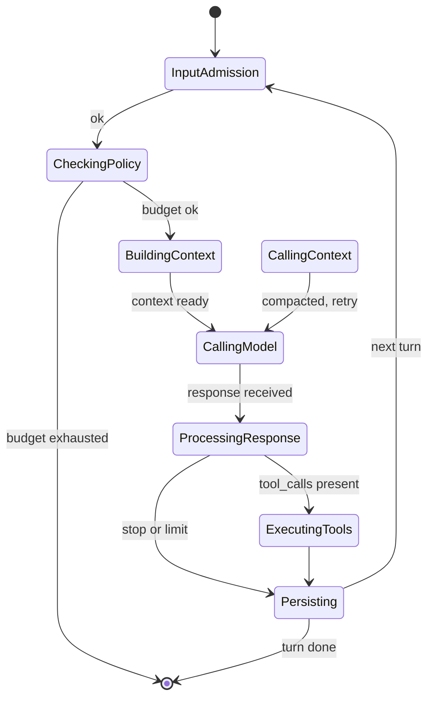

# `AgentRuntime`

> 编排器。一个结构、一个 `Arc<Extensions>`、一个 `RuntimePolicy`。

`AgentRuntime` 是执行 AI agent turn 的入口。它是运行时中唯一拥有完整执行循环的结构：输入准入、上下文构建、模型调用、工具执行、持久化、事件发射、优雅关闭。其它所有内容都是编排器按需从 `Arc<Extensions>` 拉取的协作者。

完整源码在 `src/runtime/agent.rs`。

## 为什么需要单一编排器

在可组合运行时重构之前，等价的 `AgentRuntime` 是一个宽结构，构造器接收**十一个**参数（每个协作者一个）。每个协作者都必须按正确顺序、带着正确约束在调用点接好。可组合运行时用单一的 `Arc<Extensions>` facade 替换了这一切：

- **单一事实源** —— 每个协作者都藏在 `ExtensionPoint<T>` 后面。Runtime 从 facade 读。
- **可热插拔** —— 任意协作者都可在运行时通过 `ExtensionPoint::replace` 或 drain-aware 协议替换。Runtime 不需要重建。
- **廉价克隆** —— 克隆 `Arc<Extensions>` 廉价，所以 runtime 可以自由分发内部引用（例如给 `BackgroundJobPool` 和 `SnapshotStore`），不复制。
- **测试隔离** —— 只关心单个维度的测试只需注册一个字段，其余留空。无需在测试中构造完整 provider 栈。

## 构造

```rust
use std::sync::Arc;
use behest::runtime::agent::AgentRuntime;
use behest::runtime::extensions::Extensions;
use behest::runtime::policy::RuntimePolicy;

let exts = Arc::new(Extensions::default());
let runtime = AgentRuntime::new(exts, RuntimePolicy::default());
```

`AgentRuntime::new` 接收两个参数：

- `extensions: Arc<Extensions>` —— facade。Runtime 从中读取协作者。
- `policy: RuntimePolicy` —— 运维 policy。限制、预算、超时。

它**不**单独接收 provider registry、store 句柄或 tool 集合。要填充 facade，用 `AgentConfig::into_extensions`（高层路径），或直接调用 `register_or_replace`（底层路径）。

## 运行循环

每个 turn 走一个 6 状态有限状态机。

```text
InputAdmission → CheckingPolicy → BuildingContext → CallingModel
                                                       │
                                                       ▼
                                              ProcessingResponse
                                                       │
                                       ┌───────────────┴────────────────┐
                                       ▼                                ▼
                              ExecutingTools                   [break loop]
                                       │
                                       ▼
                                  Persisting ──→ back to InputAdmission
```



状态机在 `src/runtime/turn.rs` 中实现（`TurnState`、`TurnTransition`）。`agent.rs` 中的编排器驱动循环，在转换之间持久化事件与快照。

## 公共 API

```rust
impl AgentRuntime {
    pub fn new(extensions: Arc<Extensions>, policy: RuntimePolicy) -> Result<Self, RuntimeError>;

    pub fn extensions(&self) -> &Arc<Extensions>;

    pub async fn run(&self, req: RunRequest) -> Result<RunOutput, RuntimeError>;
    pub async fn run_stream(&self, req: RunRequest) -> Result<RunStream, RuntimeError>;

    pub async fn resume(&self, snapshot: Snapshot) -> Result<RunOutput, RuntimeError>;
    pub async fn snapshot(&self, run_id: RunId) -> Result<Option<Snapshot>, RuntimeError>;

    pub async fn cancel(&self, run_id: RunId) -> Result<(), RuntimeError>;
    pub fn session_gate(&self) -> &SessionGate;

    pub async fn run_events(&self, run_id: RunId) -> Result<Vec<RuntimeEventEnvelope>, RuntimeError>;
    pub async fn run_state(&self, run_id: RunId) -> Result<RunState, RuntimeError>;
}
```

### `RunRequest` 与 `RunOutput`

```rust
pub struct RunRequest {
    pub session_id: Option<Uuid>,
    pub run_id: Option<RunId>,
    pub provider: ProviderId,
    pub model: ModelName,
    pub input: String,
    pub metadata: serde_json::Value,
    pub tool_choice: ToolChoice,
    pub client_request_id: Option<String>,
}

pub struct RunOutput {
    pub run_id: RunId,
    pub session_id: Uuid,
    pub final_message: String,
    pub total_usage: TokenUsage,
    pub tool_executions: Vec<ToolExecution>,
    pub finish_reason: FinishReason,
    pub events: Vec<RuntimeEventEnvelope>,
}
```

## 流式

`run_stream` 返回 `RunStream`，按事件触发顺序产出 `AgentEvent`。内部编排器把模型调用包在 `StreamAccumulator` 中，增量地从 provider 流中拼接文本与 tool call 参数。

```rust
use futures::StreamExt;

let mut stream = runtime.run_stream(req).await?;
while let Some(event) = stream.next().await {
    match event? {
        AgentEvent::TextDelta { delta, .. } => print!("{delta}"),
        AgentEvent::TurnCompleted { .. }     => break,
        _ => {}
    }
}
```

对长时间运行的 run，调用方可以 drop `RunStream`，转而通过 `RuntimeSubscriptionHub` 订阅事件。

## 崩溃恢复

每个状态转换前都会保存 snapshot。在两个转换之间崩溃的 run，可以通过 `runtime.resume(snapshot)` 从 snapshot 恢复。恢复时回放转换以重建 run 状态，并从最后一个稳定点继续。

Snapshot 存放在 `Extensions::snapshot_stores` 中注册的 `SnapshotStore` 里。默认是文件系统支持的 `FileSnapshotStore`；内存版 `MemorySnapshotStore` 用于测试。

## 取消

`runtime.cancel(run_id)` 是非阻塞的尽力而为信号。下一次 run 循环让出时（在 tool call 之间，或下一次模型调用时），观察到取消并以 `RunStatus::Cancelled` 终止。In-flight 的模型调用不会在 HTTP 层被打断 —— runtime 等待当前 stream chunk 到达，请求下一个 chunk 前检查取消标志。

## 配置

Runtime 的行为由 `RuntimePolicy` 控制：

```rust
pub struct RuntimePolicy {
    pub max_iterations: usize,
    pub max_input_tokens: usize,
    pub max_total_tokens: usize,
    pub provider_timeout: Duration,
    pub tool_timeout: Duration,
    pub session_gate: SessionGateConfig,
    pub input_admission: InputAdmissionConfig,
    pub router: RouterPolicy,
    pub event_buffer: usize,
}
```

完整参考见 **[Runtime Policy](runtime-policy.md)**。

## 完整示例

```rust
use std::sync::Arc;
use behest::runtime::agent::AgentRuntime;
use behest::runtime::extensions::Extensions;
use behest::runtime::policy::RuntimePolicy;
use behest::provider::{ProviderId, ModelName, RunRequest, ToolChoice};

#[tokio::main]
async fn main() -> Result<(), Box<dyn std::error::Error>> {
    let mut exts = Extensions::default();
    exts.chat_providers.register("openai", Arc::new(openai_adapter))?;
    exts.session_stores.register("memory", Arc::new(MemorySessionStore::new()))?;

    let runtime = AgentRuntime::new(Arc::new(exts), RuntimePolicy::default());

    let req = RunRequest {
        session_id: None,
        run_id: None,
        provider: ProviderId::new("openai"),
        model: ModelName::new("gpt-4o-mini"),
        input: "Hello!".into(),
        metadata: serde_json::Value::Null,
        tool_choice: ToolChoice::Auto,
        client_request_id: None,
    };

    let output = runtime.run(req).await?;
    println!("{}", output.final_message);
    Ok(())
}
```

## 边界情况

- **空 `chat_providers`** —— `runtime.run` 从 model router 返回 `RuntimeError::Provider(Unsupported)`。没有隐式回退；调用方应至少注册一个 provider。
- **流中被取消** —— run 以 `RunStatus::Cancelled` 终止。In-flight 的 provider 请求完成（结果被丢弃），run 被持久化，截至此刻的事件被返回。
- **Snapshot 写入失败** —— 转换被**回滚**。状态机是 fail-stop 的：snapshot 写入失败视为失败转换，run 留在之前的状态。错误通过 `RuntimeError::SnapshotFailed` 报告。
- **同一 session 的并发 run** —— `SessionGate` 保证串行化。第二个 run 阻塞直到第一个完成。`session_gate_timeout` policy 控制第二个 run 等待多久后放弃。
- **Provider 超时** —— `provider_timeout` policy 在模型调用上强制 wall-clock 期限。当前 stream chunk 允许完成；不发起下一次请求。
- **Doom loop** —— 如果同一 tool 被反复调用且无进展，`DoomLoopDetector` 抛出 `RuntimeError::DoomLoop { fingerprint, .. }`。Run 终止；Operator 可介入。

## 与其它组件的关系

`AgentRuntime` 是 `Extensions` facade 的**顶层消费者**。每个协作者都按需读取：

- **[Extensions](../core/extensions-facade.md)** —— 输入。
- **[Turn FSM](turn-fsm.md)** —— 循环。
- **[ModelRouter](model-router.md)** —— provider 路由、重试、回退。
- **[ContextPipeline](context-pipeline.md)** —— 上下文构建 + 压缩 filter。
- **[CompactionService](compaction-service.md)** —— 主动与被动的上下文压缩。
- **[InputAdmission](input-admission.md)** —— 输入校验 / 去重 / 准入。
- **[SessionGate](session-gate.md)** —— per-session 串行化。
- **[SnapshotStore](snapshot-store.md)** —— 崩溃恢复。
- **[DoomLoopDetector](doom-loop-detector.md)** —— 重复 / 循环检测。
- **[BackgroundJobPool](background-job-pool.md)** —— 异步事件持久化。
- **[RuntimePolicy](runtime-policy.md)** —— 运维限制。
- **[StreamAccumulator](stream-accumulator.md)** —— 增量流拼接。
- **[RunState](run-state.md)** —— 事件溯源状态投影。

## 另见

- **[Extensions Facade](../core/extensions-facade.md)** —— 输入。
- **[Turn FSM](turn-fsm.md)** —— 循环。
- **[AgentEvent](../../events/agent-event)** —— 输出。
- **[ManagedRuntime](../../ops/managed-runtime.md)** —— 计划的顶层编排器。
