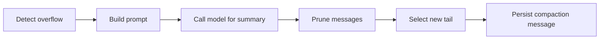

# `CompactionService`

> 当 session 历史溢出模型的 context window 时进行裁剪。

**Turn FSM** 在两种情况下调用 `CompactionService`：

- **主动**：当 `ContextPipeline` 报告请求的 context 超出预算（token 裁剪之后）。
- **被动**：当模型返回 `context_overflow` 错误（如 OpenAI 的 `context_length_exceeded`）。

该服务运行一个 4 阶段管线：**overflow → prompt → summary → prune → select**。每个阶段是一个独立的函数模块；编排器把它们组合起来。

完整源码在 `src/runtime/compaction/mod.rs`；阶段分别位于 `overflow.rs`、`prompt.rs`、`prune.rs`、`select.rs`。

## 管线



### `overflow.rs`

检测是否需要压缩。两个信号：

- Token 数超出模型上限（`ContextOverBudget`）。
- 消息数超出配置的 max（默认 50）。

判断是**幂等的**：相同输入总是产生相同结果，FSM 可以安全地重试 `CompactionService::compact`。

### `prompt.rs`

构建 LLM prompt，要求模型摘要最早的消息。prompt 包含：

- 描述摘要格式的系统指令（要点列表，便于解析）。
- 待摘要的消息，保留角色。
- 保留事实细节（数字、名字、决定），去掉寒暄。

### `prune.rs`

应用摘要：把被摘要的消息标记为 `is_compaction: true`，附上带 `summary_text` 的 `CompactionMeta`，并把 `MessageRecord` 的 `tail_start_id` 更新为指向被摘要范围**之后**的第一条消息。

### `select.rs`

决定哪些消息作为 immediate tail 保留（模型直接看到原始消息），哪些进入摘要。默认是保留最近 4 轮（8 条）原始消息，摘要更早的全部。可通过 `CompactionConfig::keep_recent_turns` 配置。

## API

```rust
pub struct CompactionService {
    router: Arc<ModelRouter>,
    store: Arc<dyn SessionStore>,
    config: CompactionConfig,
}

impl CompactionService {
    pub fn new(
        router: Arc<ModelRouter>,
        store: Arc<dyn SessionStore>,
        config: CompactionConfig,
    ) -> Self;

    pub async fn compact(
        &self,
        session_id: Uuid,
        trigger: CompactionTrigger,
    ) -> Result<CompactionResult, RuntimeError>;
}

pub struct CompactionConfig {
    pub keep_recent_turns: usize,        // default 4
    pub max_summary_tokens: usize,       // default 1000
    pub summary_model: ModelName,         // default: 与 runtime 相同
    pub summary_provider: ProviderId,
    pub enable_incremental: bool,         // default true
}
```

### 错误

```rust
pub enum CompactionError {
    NoMessagesToCompact,
    SummaryFailed(ProviderError),
    PersistFailed(StorageError),
    CircuitOpen,   // 失败次数过多后
}
```

## 幂等性

管线是**幂等的**：对同一 session 用相同 trigger 调用 `compact` 两次会得到相同的最终状态。这让 FSM 能重试 `CompactAndRetry` 而不产生重复的压缩消息。

幂等 key 是 `(session_id, last_summarised_message_id, current_head_count)`。如果 key 与现有压缩消息匹配，这次调用是 no-op。

## 增量压缩

当 `enable_incremental` 为 true 且发现已有压缩时，服务不会从头重新摘要。它只摘要**自上次压缩以来的新消息**，然后把现有摘要与新 delta 拼接。这样每次 turn 都能保持摘要最新，而不必付出完整的成本。

## 熔断

如果压缩调用失败（例如模型返回错误），服务会递增每个 session 的计数器。达到 `max_failures`（默认 3）后，session 被标记为 `CompactionCircuitOpen`，后续调用返回 `CompactionError::CircuitOpen`，直到 Operator 介入。熔断也会通过 `AgentEvent::CompactionCircuitOpened` 抛出，让外部观察者能采取行动。

## 边界情况

- **空 session** —— 返回 `CompactionError::NoMessagesToCompact`。不是错误条件；只是 no-op。
- **所有消息已被压缩** —— 服务返回已有摘要。不发新 LLM 调用。
- **摘要模型的 token 上限低于待摘要消息** —— 服务对输入分块，逐块摘要，再对块摘要做摘要。递归，受 `max_summary_tokens` 约束。

## 与其它组件的关系

- **[ContextPipeline](context-pipeline.md)** —— 在溢出时调用。
- **[Turn FSM](turn-fsm.md)** —— 从 `CompactAndRetry` 动作调用。
- **[ModelRouter](model-router.md)** —— 用来调用摘要模型。
- **[SessionStore](../../storage/session-store)** —— 持久化压缩消息。

## 另见

- **[ContextPipeline](context-pipeline.md)** —— 调用方。
- **[Turn FSM](turn-fsm.md)** —— 编排器。
- **[ModelRouter](model-router.md)** —— 底层模型调用。
