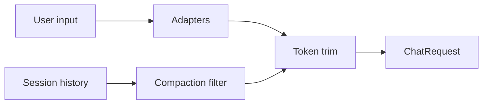

# `ContextPipeline`

> 运行时的上下文构建器。

`ContextPipeline` 从用户输入和 session 状态构造 `ChatRequest`。它按顺序运行 `ContextAdapter`，应用压缩 filter（已被摘要的消息不重发），并裁剪结果以匹配 token 预算。

完整源码在 `src/runtime/context.rs`。

## 阶段



1. **Adapters** —— 调用 `Extensions::context_adapters` 中注册的每个 `ContextAdapter` 注入额外上下文（系统 prompt、RAG 片段、函数输出）。
2. **压缩 filter** —— 丢弃标记为 `is_compaction: true` 且其 `CompactionMeta::summary_text` 仍在作用域的消息；模型收到的是摘要而非原始消息。
3. **Token 裁剪** —— 通过裁剪最旧的非系统消息，把消息列表装入模型的 context window。

## API

```rust
pub struct ContextPipeline {
    adapters: Vec<Arc<dyn ContextAdapter>>,
    max_history_messages: usize,
    max_history_tokens: usize,
    enable_compaction_filter: bool,
}

impl ContextPipeline {
    pub fn new() -> Self;
    pub fn with_adapter(self, a: Arc<dyn ContextAdapter>) -> Self;
    pub fn with_max_history(self, n: usize) -> Self;
    pub fn with_max_history_tokens(self, n: usize) -> Self;
    pub fn with_compaction_filter(self, on: bool) -> Self;

    pub async fn build(
        &self,
        session: &Session,
        input: &str,
        store: &dyn SessionStore,
    ) -> Result<ChatRequest, ContextError>;
}
```

## 完整示例

```rust
let pipeline = ContextPipeline::new()
    .with_adapter(Arc::new(StaticAdapter::new("You are concise.")))
    .with_adapter(Arc::new(RagContextAdapter::new(qdrant)))
    .with_max_history(50)
    .with_max_history_tokens(64_000)
    .with_compaction_filter(true);

let req = pipeline.build(&session, "Hello", &*store).await?;
```

## 另见

- **[CompactionService](compaction-service.md)** —— 产出压缩消息。
- **[ContextAdapter](../../tools/context-adapter)** —— 适配器 trait。
- **[RAG Context Adapter](../../tools/rag-context-adapter)** —— RAG 实现。
