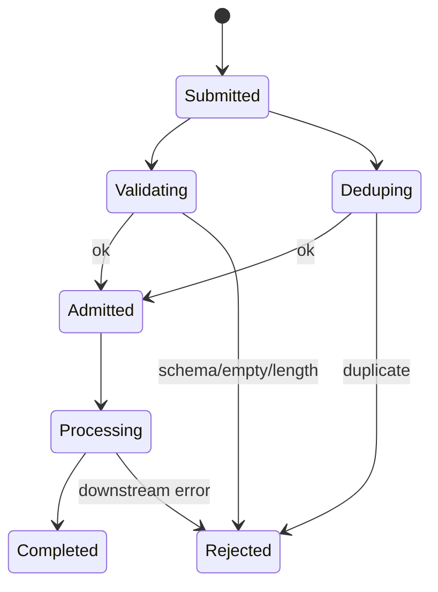

# `InputAdmission`

> 每个 turn 的第一道关。

`InputAdmission` 在每个 turn 开始时被调用。它按顺序执行三个检查：

1. **校验** —— 输入非空、不超过长度限制、匹配配置的 schema。
2. **去重** —— 输入的内容指纹在同 session 上没有正在 in-flight。
3. **准入** —— 输入被分配 `InputId`，并记录到 per-session 准入日志。

任何检查失败，run 以 `RunStatus::Rejected` 终止，并发出 `InputEvent::Rejected`。

完整源码在 `src/runtime/input.rs`。

## 状态机



## API

```rust
pub struct InputAdmission {
    config: InputAdmissionConfig,
    inflight: Mutex<HashMap<Uuid, InputRecord>>,
}

pub struct InputAdmissionConfig {
    pub max_input_length: usize,          // default: 64 KiB
    pub reject_empty: bool,                // default: true
    pub dedup_window: Duration,            // default: 60s
    pub max_concurrent_per_session: usize, // default: 1
}

impl InputAdmission {
    pub fn new(config: InputAdmissionConfig) -> Self;
    pub async fn admit(&self, session_id: Uuid, content: &str) -> Result<InputId, InputEvent>;
    pub fn complete(&self, id: InputId, result: InputOutcome);
    pub fn reject(&self, id: InputId, reason: &str);
    pub fn inflight(&self) -> Vec<InputRecord>;
}
```

## 去重

去重 key 是输入内容的 SHA-256，作用域是 session。如果相同指纹在 `dedup_window` 内再次出现，第二次准入被拒绝并以 `InputEvent::Rejected { reason: "duplicate" }` 拒绝。窗口是 per-session；不同 session 上的重复不会被拒绝。

## 边界情况

- **空输入** —— `reject_empty: true`（默认）以 `InputEvent::Rejected { reason: "empty" }` 拒绝。
- **长度限制** —— `max_input_length: 64 * 1024` 默认。超过限制的输入被拒绝。
- **同 session 并发** —— `max_concurrent_per_session: 1`（默认）阻塞第二次准入直到第一次完成。
- **准入中途崩溃** —— inflight 记录保留到 session 被清理（默认：5 分钟）。来自同一 client 的下一次准入带上 `client_request_id`，使去重能识别 retry。

## 另见

- **[AgentRuntime](agent-runtime.md)** —— 调用方。
- **[Turn FSM](turn-fsm.md)** —— 编排器。
- **[SessionGate](session-gate.md)** —— 串行化 session 访问的伙伴。
