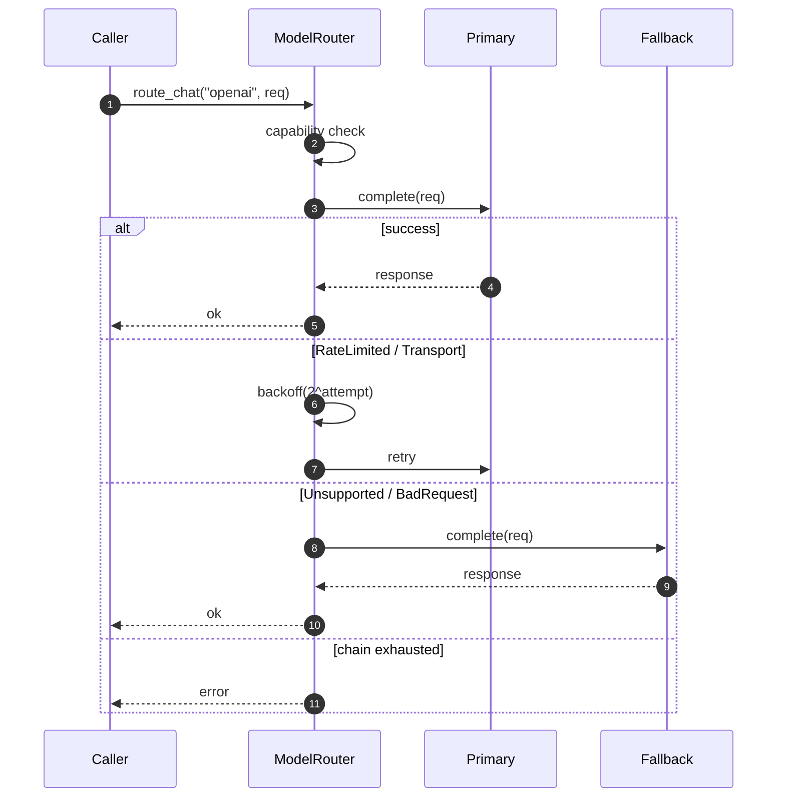

# `ModelRouter`

> 能力检查 + 重试 + 回退链，作用于 chat 与 embedding provider。

`ModelRouter` 是运行时与 provider 世界之间的接口。它包装一个 `ProviderRegistry`，校验请求的 provider 是否支持请求的能力，对瞬时失败用指数退避重试，并在主 provider 不可用时走配置的回退链。

完整源码在 `src/runtime/router.rs`。

## 为什么需要 router

Provider registry 回答"这个名字注册了吗？"Router 回答"这个名字**此刻**对这次请求**可用**吗？"Router 编码了每个 `AgentRuntime` 调用都需要的运维语义：

- **能力检查** —— provider 是否支持 chat？流式？请求的 tool 格式？
- **退避重试** —— `RateLimited` 与 `Transport` 错误会被重试；`Unsupported` 与 `BadRequest` 不会。
- **回退链** —— 如果主 provider 不可用，尝试链上下一个。只有当链耗尽时调用才失败。
- **超时** —— `provider_timeout` policy 限制调用的 wall-clock 时长，包含重试。

## 构造

```rust
use std::sync::Arc;
use behest::runtime::router::{ModelRouter, RouterPolicy};
use behest::provider::ProviderRegistry;

let registry = Arc::new(ProviderRegistry::from_extensions(&exts));
let policy = RouterPolicy {
    fallbacks: vec!["anthropic".into()],   // 主是请求中的那个；失败时尝试这些
    max_retries: 2,
    initial_backoff: Duration::from_millis(100),
    max_backoff: Duration::from_secs(10),
    ..Default::default()
};
let router = ModelRouter::new(registry, policy);
```

Router **接收 `Arc<ProviderRegistry>`**，而不是 owned 版本。这让 runtime 能在另一个任务热替换 registry 的同时调用 `ModelRouter::route_chat`。`ExtensionPoint` 支撑的 registry 总是返回最新注册的 `Arc<T>`。

## API

```rust
impl ModelRouter {
    pub fn new(registry: Arc<ProviderRegistry>, policy: RouterPolicy) -> Self;

    pub async fn route_chat(
        &self,
        provider: &ProviderId,
        request: ChatRequest,
    ) -> Result<ChatResponse, RuntimeError>;

    pub async fn route_chat_stream(
        &self,
        provider: &ProviderId,
        request: ChatRequest,
    ) -> Result<ChatStream, RuntimeError>;

    pub async fn route_embedding(
        &self,
        provider: &ProviderId,
        request: EmbeddingRequest,
    ) -> Result<EmbeddingResponse, RuntimeError>;

    pub fn registry(&self) -> &Arc<ProviderRegistry>;
}
```

`route_chat` 是主力；其它方法遵循相同的重试 / 回退模式。

## 路由流



Router 的 `RouterPolicy` 控制链。`fallbacks` 列表按顺序查询；每个条目都用相同的重试循环尝试。只有当所有回退上的所有重试都耗尽时，才返回 `ProviderError`。

## 能力检查

Router 读取 provider 的 `ProviderCapabilities`（由 `ChatProvider::capabilities()` 返回），拒绝请求不支持的能力：

```rust
pub struct ProviderCapabilities {
    pub chat: bool,
    pub chat_stream: bool,
    pub embeddings: bool,
    pub tool_calls: bool,
    pub vision: bool,
    // ...
}
```

对一个不支持 `chat_stream` 的 provider 调用 `route_chat_stream` 会返回 `RuntimeError::Provider(Unsupported)`，不接触网络。

## 重试分类

Router 读 `ProviderError::is_retryable()`。默认：

- `RateLimited { .. }` —— 可重试
- `Timeout { .. }` —— 可重试
- `Overloaded { .. }` —— 可重试
- `Transport { .. }` —— 可重试
- `Authentication { .. }` —— **不可**重试
- `Unsupported { .. }` —— 不可重试
- `BadRequest { .. }` —— 不可重试
- `Decode { .. }` —— 不可重试（响应是畸形的；重试也无效）

退避是指数的：`initial_backoff * 2^attempt`，封顶 `max_backoff`。加上少量抖动（±10%）以避免大量并行 run 同步重试。

## 完整示例

```rust
use std::sync::Arc;
use std::time::Duration;
use behest::runtime::router::{ModelRouter, RouterPolicy};
use behest::provider::ProviderRegistry;

let registry = Arc::new(ProviderRegistry::default());
registry.register_chat(openai_adapter);
registry.register_chat(anthropic_adapter);

let router = ModelRouter::new(
    registry,
    RouterPolicy {
        fallbacks: vec!["anthropic".into()],
        max_retries: 2,
        initial_backoff: Duration::from_millis(200),
        max_backoff: Duration::from_secs(5),
        ..Default::default()
    },
);

let response = router.route_chat(&"openai".into(), req).await?;
// 若 `openai` 限流，router 会重试，然后回退到 `anthropic`。
```

## 边界情况

- **空回退链** —— `fallbacks: vec![]` 意味着 router 只尝试主 provider。失败按原样上报。
- **主和回退是同一个 provider** —— 链有效变短；这是配置 bug，不是 router 错误。
- **Provider 返回 `Overloaded` 然后重试成功** —— 用户看不到失败。重试不可见。
- **能力检查通过，但请求以不明显方式要求不支持的能力** —— provider 返回 `Unsupported`，router **不**重试。错误被上报。

## 与其它组件的关系

- **[ProviderRegistry](../../providers/provider-registry)** —— 底层存储。
- **[ChatProvider](../../providers/chat-provider)** —— router 路由到的 trait。
- **[AgentRuntime](agent-runtime.md)** —— 消费者。
- **[Turn FSM](turn-fsm.md)** —— 从 `CallingModel` 状态调用 router。

## 另见

- **[ProviderRegistry](../../providers/provider-registry)** —— 存储层。
- **[AgentRuntime](agent-runtime.md)** —— 调用方。
- **[Turn FSM](turn-fsm.md)** —— 使用 router 的循环步骤。
