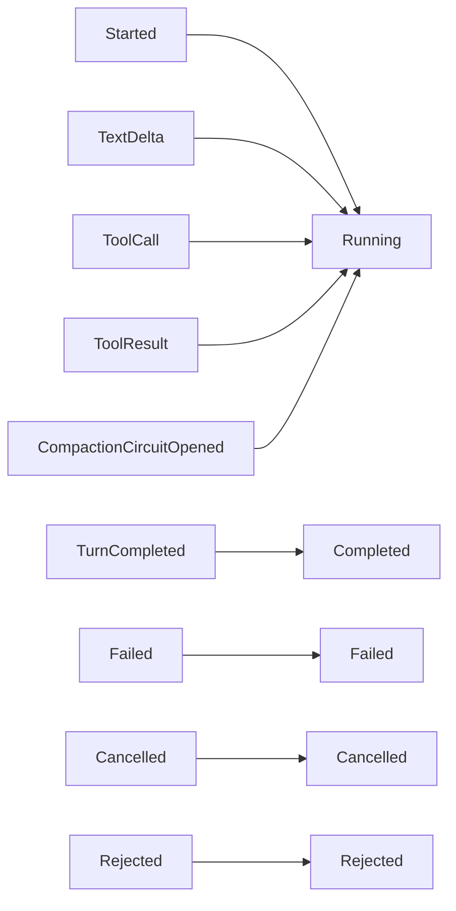

# `RunState`

> Run 的事件溯源投影。

`RunState` 是折叠一个 run 的 `AgentEvent` 序列得到的结果。它包含外部观察者（UI、CLI、其它服务）通常需要的信息：当前 status、累计 token 用量、最后的 finish reason、最后一个事件的时间戳。

完整源码在 `src/runtime/state.rs`。

## 状态

```rust
pub struct RunState {
    pub run_id: RunId,
    pub session_id: Uuid,
    pub status: RunStatus,
    pub iteration: usize,
    pub total_usage: TokenUsage,
    pub last_finish: Option<FinishReason>,
    pub last_error: Option<String>,
    pub last_event_at: DateTime<Utc>,
    pub events: Vec<AgentEvent>,
}

pub enum RunStatus {
    Pending,
    Running,
    Completed,
    Failed,
    Cancelled,
    Rejected,
}
```

## 投影



折叠是确定且纯的：给定相同的事件序列，投影相同。这就是运行时**可崩溃恢复**的原因：从 `RunStore` 回放事件，得到相同的 `RunState`。

## API

```rust
impl RunState {
    pub fn project(events: Vec<AgentEvent>) -> Self;
    pub fn from_run_store(store: &dyn RunStore, run_id: RunId) -> impl Future<Output = Result<Self, RuntimeError>>;
    pub fn is_terminal(&self) -> bool;
}
```

`is_terminal` 对 `Completed`、`Failed`、`Cancelled`、`Rejected` 返回 `true`。

## 边界情况

- **空事件序列** —— `status: Pending`，`iteration: 0`，`total_usage: 0`。Run 尚未开始。
- **乱序事件** —— 投影对同一 `seq` 范围内的重排有容忍度；重复的 `seq` 视为同一事件。
- **截断的序列** —— 投影基于可用事件计算。Status 是最后一个事件所暗示的；例如最后一个事件是 `TextDelta` 但没有 `TurnCompleted`，status 是 `Running`。

## 另见

- **[AgentRuntime](agent-runtime.md)** —— 事件的生产者。
- **[AgentEvent](../../events/agent-event)** —— 事件类型。
- **[RunStore](../../storage/run-store)** —— 持久化存储。
