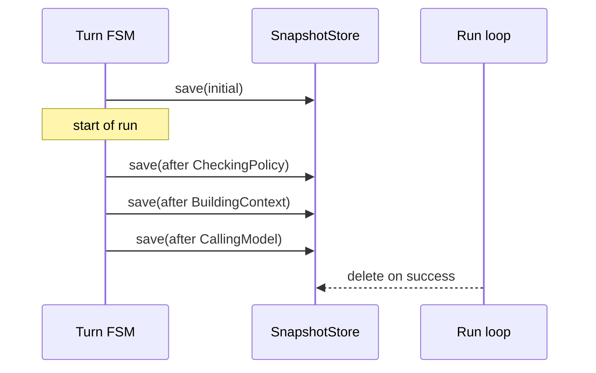

# `SnapshotStore`

> 每个状态转换的快照，用于崩溃恢复。

`SnapshotStore` 在每个状态转换时持久化 FSM 状态。在两个转换之间崩溃的 run 可以通过 `AgentRuntime::resume(snapshot)` 从最近的快照恢复。成功的 run 在结束时会删除它们的快照。

完整源码在 `src/runtime/snapshot.rs`。

## 后端

- **`MemorySnapshotStore`** —— 内存版，默认。用于测试和 `Memory*Component` 集合。
- **`FileSnapshotStore`** —— 文件系统支持，生产默认。把每个 run 的快照存为配置根目录下的一个 JSON 文件。
- **`S3SnapshotStore`** —— S3 支持；feature-gated by `object_store`。

## API

```rust
pub trait SnapshotStore: Send + Sync {
    async fn save(&self, run_id: RunId, snapshot: &Snapshot) -> Result<(), SnapshotError>;
    async fn load(&self, run_id: RunId) -> Result<Option<Snapshot>, SnapshotError>;
    async fn delete(&self, run_id: RunId) -> Result<(), SnapshotError>;
    async fn list(&self) -> Result<Vec<RunId>, SnapshotError>;
}

pub struct Snapshot {
    pub run_id: RunId,
    pub state: TurnState,
    pub session_id: Uuid,
    pub provider: ProviderId,
    pub model: ModelName,
    pub iteration: usize,
    pub total_usage: TokenUsage,
    pub context: Option<ChatRequest>,
    pub tool_results: Vec<ToolExecution>,
    pub seq: u64,
    pub created_at: DateTime<Utc>,
}
```

## 生命周期



快照在每次 save 时**覆盖**；只有最新的存活。`seq` 字段单调递增，是 `RuntimeEventEnvelope::seq` 回放所引用的。

## Resume

`AgentRuntime::resume(snapshot)` 从 snapshot 重建 `RunState`，推进到下一个状态并继续。如果 snapshot 属于一个已访问过的状态，resume 从**下一个**状态重新进入 —— 不会重放已访问过的状态。

## 边界情况

- **Snapshot 写入失败** —— 转换被**回滚**（fail-stop）。Run 留在之前的状态，返回 `RuntimeError::SnapshotFailed`。Operator 可以重试。
- **过期 snapshot** —— 如果 `load` 返回的 snapshot `seq` 早于 `RunStore` 中最新事件，snapshot 被丢弃，run 从事件重建。（这是自愈路径。）
- **Snapshot 缺失** —— `runtime.snapshot(run_id)` 返回 `None`。Run 处于初始状态；没有可恢复的内容。

## 另见

- **[AgentRuntime](agent-runtime.md)** —— 调用方。
- **[Turn FSM](turn-fsm.md)** —— 驱动 snapshot 的编排器。
- **[RunState](run-state.md)** —— 从 snapshot 重建的投影。
