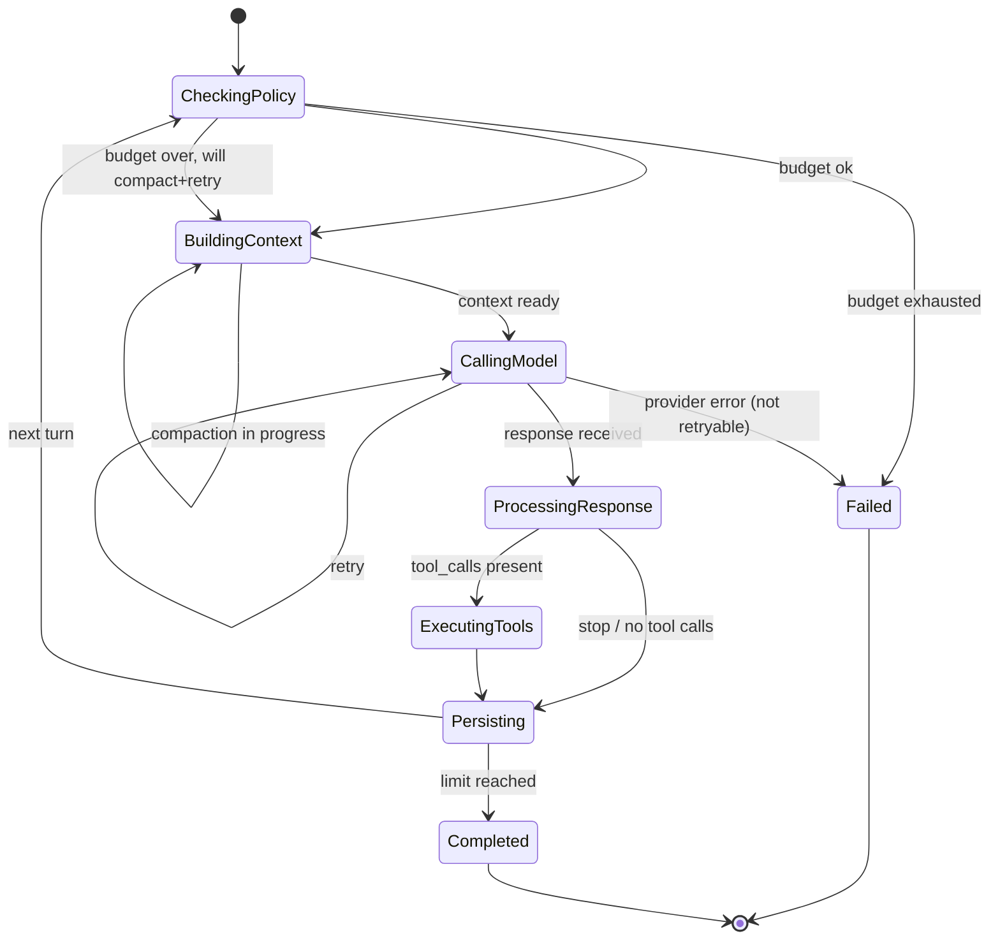

# Turn FSM

> 决定每个 turn 下一步发生什么的状态机。

Turn FSM 是运行时的确定性核心。`AgentRuntime` 是编排器，`Extensions` 是数据，FSM 才是**决策** —— 给定当前状态和上一步结果，下一步是什么？每个状态都有到其他状态的合法转移集合；FSM 是全的，所以不崩溃的 turn 一定会终止。

完整源码在 `src/runtime/turn.rs`。

## 6 个状态



### `CheckingPolicy`

每个 turn 的第一个状态。FSM 询问 `RuntimePolicy`：

- 是否超过 `max_iterations`？若是，失败并以 `RunStatus::LimitReached` 终止。
- 是否超过 `max_total_tokens`？若是，失败并以 `RunStatus::TokenBudgetExhausted` 终止。
- 否则，转移到 `BuildingContext`。

### `BuildingContext`

FSM 调用 `ContextPipeline::build`，它会加载 session 历史、应用压缩 filter、裁剪到 token 预算。如果 build 返回的 context 在压缩后仍然超预算，FSM 返回 `CompactAndRetry`，即：调用 `CompactionService` 摘要最早的消息，然后回到 `BuildingContext`。

### `CallingModel`

FSM 委派给 `ModelRouter::route_chat`，它选择 provider、应用能力检查、用指数退避处理重试。Router 返回 `ChatResponse`（或流）或 `ProviderError`。瞬时错误（rate limit、transport）触发重试；永久错误（unsupported、bad request）让 turn 失败。

### `ProcessingResponse`

FSM 检查响应的 `finish_reason` 与 `tool_calls`：

- 若 `finish_reason == ToolCalls`，转移到 `ExecutingTools`。
- 若 `finish_reason == Stop` 或到达迭代上限，转移到 `Persisting`（不再有 turn）。
- 若 `finish_reason == Length`（输出被截断），FSM 可能会按 policy 继续下一轮 turn 让模型续写。

### `ExecutingTools`

FSM 委派给 `ToolRuntime`，它校验参数、应用每个 tool 的超时、分到并发 / 排他执行组、派发。所有 tool call 完成后，FSM 记录 `ToolExecution` 并转移到 `Persisting`。

### `Persisting`

FSM 把新消息写入 `SessionStore`，向 `RunStore` 追加 `RunEventRecord`，并向 `BackgroundJobPool` 排队一个异步事件持久化任务。如果还需要更多 turn（且 policy 允许），循环回到 `CheckingPolicy`。否则 run 以 `Completed` 或 `Failed` 终止。

## 转移函数

```rust
pub fn TurnTransition::resolve(
    state: TurnState,
    outcome: TurnOutcome,
) -> TurnAction;

pub enum TurnState {
    CheckingPolicy,
    BuildingContext,
    CallingModel,
    ProcessingResponse,
    ExecutingTools,
    Persisting,
}

pub enum TurnOutcome {
    Ok,
    PolicyExhausted { reason: PolicyReason },
    ContextReady { context: ChatRequest },
    ContextOverBudget,
    CompactionTriggered,
    ModelResponse(ChatResponse),
    ProviderError(ProviderError),
    ToolCallsPresent,
    NoMoreTurns,
    ToolResultsRecorded,
    Persisted,
}

pub enum TurnAction {
    Continue(TurnState),
    CompactAndRetry,
    BreakLoop,
    Fail(RuntimeError),
}
```

转移函数是**纯函数** —— 不接触 I/O。编排器负责执行每个转移的副作用（例如派发 tool call），然后用下一个 outcome 调用 `resolve`。

## 确定性

因为转移函数是纯的，FSM 在给定 outcome 序列时是确定的。这带来两个后果：

1. **回放。** 给定一段记录的 `TurnOutcome` 序列（这正是 `RunEventRecord` 的内容），FSM 可以精确重现 run。这是 **[Run State](run-state.md)** 投影的基础。
2. **可测性。** FSM 可以通过喂入 `TurnOutcome` 序列并断言产生的 `TurnAction` 序列来做单元测试。无需 mock I/O。

## 边界情况

- **必须经过所有状态** —— FSM 不允许跳过状态。没有前导 `Persisting` outcome 就出现 `Persisting` action 是 bug。
- **重新进入 `BuildingContext`** —— 仅在 `CompactAndRetry` 之后发生。FSM 在新 context 构建完成前不会回到 `CheckingPolicy`；这避免了失控的压缩循环。
- **任何状态下的取消** —— run 循环中的 `Cancel` 信号会短路转移。当前状态的 outcome 记为 `Cancelled`，run 终止。

## 与其它组件的关系

- **[AgentRuntime](agent-runtime.md)** —— 驱动 FSM 的编排器。
- **[ModelRouter](model-router.md)** —— `CallingModel` 调用。
- **[ContextPipeline](context-pipeline.md)** —— `BuildingContext` 调用。
- **[CompactionService](compaction-service.md)** —— `CompactAndRetry` 调用。
- **[ToolRuntime](tool-runtime.md)** —— `ExecutingTools` 调用。
- **[RuntimePolicy](runtime-policy.md)** —— `CheckingPolicy` 的输入。

## 另见

- **[AgentRuntime](agent-runtime.md)** —— 编排器。
- **[ModelRouter](model-router.md)** —— `CallingModel` 步骤。
- **[RunState](run-state.md)** —— 投影。
